<div align="center">

<a href="https://evolink.ai/launch/seedance-2-5?utm_source=github&utm_medium=banner&utm_campaign=GPT-Image-2-Seedance-2.5-Workflow"></a>

[](LICENSE)
[](https://github.com/EvoLinkAI/awesome-seedance-2.5-prompts)
[](https://github.com/EvoLinkAI/Seedance-2.5-Gateway-Service)
[](https://github.com/EvoLinkAI/awesome-seedance-2.5-guide)
[](https://github.com/EvoLinkAI/awesome-gpt-image-2-prompts)


[](README.md)
[](README_es.md)
[](README_pt.md)
[](README_ja.md)
[](README_ko.md)
[](README_de.md)
[](README_fr.md)
[](README_tr.md)
[](README_zh-TW.md)
[](README_zh-CN.md)
[](README_ru.md)

</div>


## 🎬 Introduccion

Bienvenido al repositorio de flujos de trabajo GPT Image 2 × Seedance 2.5! 🤗

**Recopilamos flujos de trabajo probados, plantillas de prompts y ejemplos reales de creadores para combinar GPT Image 2 y Seedance 2.5 en la produccion de videos de IA de alta calidad.**

GPT Image 2 se encarga del "que dibujar" y la consistencia visual. Seedance 2.0 se encarga del "como mover" — animando esas imagenes en video. Juntos forman uno de los pipelines de video con IA mas capaces disponibles hoy en dia.

La mayoria de los casos en este repositorio estan seleccionados de creadores de X/Twitter, experimentos de la comunidad y flujos de trabajo de produccion reales.

Pruebalo: [GPT Image 2 + Seedance 2.5](https://evolink.ai/launch/seedance-2-5?utm_source=github&utm_medium=readme&utm_campaign=GPT-Image-2-Seedance-2.5-Workflow)

### Uso rapido

- [GPT Image 2 Gen Skill](https://github.com/EvoLinkAI/gpt-image-2-gen-skill) agrega generacion y edicion de imagenes con GPT Image 2 a tu agente
- [Seedance 2 Video Gen Skill](https://github.com/EvoLinkAI/seedance2-video-gen-skill-for-openclaw) agrega generacion de video con Seedance 2 a tu agente

### Instalacion rapida

#### Ejecutar directamente en Terminal

```bash
npx evolink-gpt-image@latest
npx evolink-seedance@latest
```

Si vas a instalarlo manualmente en Terminal, puedes ejecutar estas dos lineas tal cual. Los instaladores intentan detectar automaticamente un directorio de skills conocido y, si no lo encuentran, te preguntan donde instalar.

#### Claude Code

```bash
npx evolink-gpt-image@latest -y --path ~/.claude/skills
npx evolink-seedance@latest -y --path ~/.claude/skills
```

#### OpenCode

```bash
npx evolink-gpt-image@latest -y --path ~/.opencode/skills
npx evolink-seedance@latest -y --path ~/.opencode/skills
```

#### Cursor

```bash
npx evolink-gpt-image@latest -y --path .cursor/skills
npx evolink-seedance@latest -y --path .cursor/skills
```

#### OpenClaw

```bash
npx evolink-gpt-image@latest -y
npx evolink-seedance@latest -y
```

La version de Terminal de arriba sirve para instalacion manual. Los comandos especificos por host de abajo son mejores cuando quieres que un AI Agent instale los skills sin preguntas adicionales.

Si te resulta util, considera darle una estrella. ⭐


## 📰 Novedades

- **26 de mayo de 2026:** Añadidos 30 nuevos trabajos de creadores a la [🌟 Galería de la Comunidad](#-galería-de-la-comunidad) del lote del 17 al 23 de mayo (slugs 104–133)
- **2 de mayo de 2026:** Añadida [🌟 Galería de la Comunidad](#-galería-de-la-comunidad) — 70 últimos trabajos con GPT Image 2 × Seedance 2.5 de creadores en X (29 de abril – 2 de mayo)

## 📑 Menu

- [🎬 Introduccion](#-introduccion)
- [📰 Novedades](#-novedades)
- [📑 Menu](#-menu)
- [🎥 Tecnicas de Storyboard](#-tecnicas-de-storyboard)
  - [Caso 1: Storyboard Estandar → Video (por @kiyoshi_shin)](#caso-1-storyboard-estandar--video-por-kiyoshi_shin)
  - [Caso 2: Metodo de Storyboard en Cuadricula 3×3 (por @servasyy_ai)](#caso-2-metodo-de-storyboard-en-cuadricula-33-por-servasyy_ai)
  - [Caso 10: Referencia Multi-Cuadro → Video de Corte Rapido (por @heygentlewhale)](#caso-10-referencia-multi-cuadro--video-de-corte-rapido-por-heygentlewhale)
  - [Caso 19: Control de Costos con Storyboard Primero (por @0xbisc)](#caso-19-control-de-costos-con-storyboard-primero-por-0xbisc)
- [📱 Comercial y Producto](#-comercial-y-producto)
  - [Caso 5: Video Demo de App MVP (por @Shin_Engineer)](#caso-5-video-demo-de-app-mvp-por-shin_engineer)
  - [Caso 6: Comercial de 15 Segundos (por @ai_mitosan)](#caso-6-comercial-de-15-segundos-por-ai_mitosan)
  - [Caso 15: Comercial de Lujo — Del Storyboard al Film (por @insmind_com)](#caso-15-comercial-de-lujo--del-storyboard-al-film-por-insmind_com)
  - [Caso 16: Video Cinematografico de Comida (por @kingofdairyque)](#caso-16-video-cinematografico-de-comida-por-kingofdairyque)
  - [Caso 26: Imagen de Producto → Anuncio de Video Corto (por @insmind_com)](#caso-26-imagen-de-producto--anuncio-de-video-corto-por-insmind_com)
- [🎨 Animacion y Personaje](#-animacion-y-personaje)
  - [Caso 3: Hoja de Personaje → Animacion (por @YaReYaRu30Life)](#caso-3-hoja-de-personaje--animacion-por-yareyaru30life)
  - [Caso 4: Video Estilo OP de Anime (por @Toshi_nyaruo_AI)](#caso-4-video-estilo-op-de-anime-por-toshi_nyaruo_ai)
  - [Caso 12: Claude Code × Hoja de Personaje → Animacion (por @old_pgmrs_will)](#caso-12-claude-code--hoja-de-personaje--animacion-por-old_pgmrs_will)
  - [Caso 13: Cuadricula de Secuencia de Baile → Video de Baile (por @Ciri_ai)](#caso-13-cuadricula-de-secuencia-de-baile--video-de-baile-por-ciri_ai)
  - [Caso 14: Pagina de Comic → Video Animado (por @nimentrix)](#caso-14-pagina-de-comic--video-animado-por-nimentrix)
  - [Caso 25: Coreografia K-Pop — Control Detallado (por @Kashberg_0)](#caso-25-coreografia-k-pop--control-detallado-por-kashberg_0)
  - [Caso 27: Animacion de Presentacion de Personaje (por @0xbisc)](#caso-27-animacion-de-presentacion-de-personaje-por-0xbisc)
- [🎵 Video Musical y Cortometraje](#-video-musical-y-cortometraje)
  - [Caso 7: Video Musical con Suno (por @fukaborichannel)](#caso-7-video-musical-con-suno-por-fukaborichannel)
  - [Caso 8: Cortometraje Estilo Cyberpunk (por @ponyodong)](#caso-8-cortometraje-estilo-cyberpunk-por-ponyodong)
  - [Caso 11: MV Japones — Toolchain Completo de IA (por @Tz_2022)](#caso-11-mv-japones--toolchain-completo-de-ia-por-tz_2022)
  - [Caso 20: Shotlist de Claude → Video Musical (por @CoffeeVectors)](#caso-20-shotlist-de-claude--video-musical-por-coffeevectors)
- [🎮 Concepto de Juego](#-concepto-de-juego)
  - [Caso 9: Juego y Contenido Interactivo (por @op7418)](#caso-9-juego-y-contenido-interactivo-por-op7418)
  - [Caso 17: Animacion de Interfaz de Juego — Pipeline Completo (por @0xInk_)](#caso-17-animacion-de-interfaz-de-juego--pipeline-completo-por-0xink_)
  - [Caso 24: Concepto de Juego de Ciudad Estilo GTA (por @markgadala)](#caso-24-concepto-de-juego-de-ciudad-estilo-gta-por-markgadala)
- [🛠 Herramientas de Produccion](#-herramientas-de-produccion)
  - [Caso 18: Flujo de Trabajo Automatizado con Agente Unico (por @venturetwins)](#caso-18-flujo-de-trabajo-automatizado-con-agente-unico-por-venturetwins)
  - [Caso 21: Cuadricula de Casting — Audicion de Actores (por @8fstudioz)](#caso-21-cuadricula-de-casting--audicion-de-actores-por-8fstudioz)
  - [Caso 22: Escultura 3D → Render IA → Animacion (por @_DAntunes_)](#caso-22-escultura-3d--render-ia--animacion-por-_dantunes_)
- [🌟 Galería de la Comunidad](#-galería-de-la-comunidad)
- [💡 Consejos y Tecnicas](#-consejos-y-tecnicas)
  - [Guia de Consistencia](#guia-de-consistencia)
  - [Plantillas de Prompts](#plantillas-de-prompts)
- [🚀 Pruebalo en Evolink](#-pruebalo-en-evolink)
- [🙏 Agradecimientos](#-agradecimientos)


## 🎥 Tecnicas de Storyboard

<!-- Case 1: Standard Storyboard → Video (by @kiyoshi_shin) -->
### Caso 1: [Storyboard Estandar → Video](https://x.com/kiyoshi_shin/status/2047133524403400847) (por [@kiyoshi_shin](https://x.com/kiyoshi_shin))

El flujo de trabajo mas comun. Usa GPT Image 2 para generar un panel de storyboard, luego animalo con Seedance 2.0. Ideal para videos promocionales, dramas cortos y OPs de animacion.

<table><tr>
<td align="center"><a href="https://evolink.ai/gpt-image-2-prompts?utm_source=github&utm_medium=picture&utm_campaign=gptimage2-x-seedance2"></a></td>
<td align="center"><video src="https://github.com/user-attachments/assets/ac25fc3d-b6cb-4149-a8ba-e7e10c5b1faa" width="280" controls></video></td>
</tr></table>

**Pasos:**

1. Describe tu escena a GPT Image 2 y genera una imagen de storyboard
2. Importa el storyboard a Seedance 2.0 usando el modo Imagen-a-Video
3. Exporta cada clip y ensambla en tu software de edicion

**Prompt de GPT Image 2:**

```
Create a 6-panel storyboard for a 15-second brand promotional video. Label each panel with a shot description.
Style: cinematic, cool color tone, widescreen 16:9.
Content: the journey of a product from factory to the customer's hands.
```

**Prompt de Seedance 2.0:**

```
Cinematic brand advertisement, slow camera push-in, product centered in frame, warm side lighting, soft background blur, no people, 3 seconds.
```

> [!NOTE]
> Genera las imagenes de storyboard en 16:9 para evitar el recorte automatico de Seedance. Configura la tasa de cuadros a 24fps para coincidir con los estandares cinematograficos. Manten cada panel del storyboard simple — cuanto mas simple sea el contenido, mas preciso sera el resultado del movimiento.


<!-- Case 2: 3×3 Grid Storyboard Method (by @servasyy_ai) -->
### Caso 2: [Metodo de Storyboard en Cuadricula 3×3](https://x.com/servasyy_ai/status/2047198012750143999) (por [@servasyy_ai](https://x.com/servasyy_ai))

Una tecnica clave descubierta por la comunidad: componer todos los paneles del storyboard en una sola imagen de cuadricula 3×3 antes de importar a Seedance reduce significativamente la tasa de fallos en comparacion con importar cuadros uno por uno.

<table><tr>
<td align="center"><a href="https://evolink.ai/gpt-image-2-prompts?utm_source=github&utm_medium=picture&utm_campaign=gptimage2-x-seedance2"></a></td>
<td align="center"><video src="https://github.com/user-attachments/assets/00f32388-a17b-4b9c-8da3-1956436ce91b" width="400" controls></video></td>
</tr></table>


**Pasos:**

1️⃣ Ingresa el contenido que quieres crear + el ✅ prompt "Create a storyboard in a 3×3 grid format"
2️⃣ Crea un prompt a partir de la imagen del paso 1 con ChatGPT
3️⃣ Referencia la imagen del paso 1 en Seedance
4️⃣ Ingresa el prompt creado en el paso 2.

**Prompt de GPT Image 2:**

```
[describe your scene] and Create a storyboard in a 3×3 grid format
```

**Prompt de Seedance 2.0:**
convierte esta imagen en video
```
[Describe the motion and style. Example: Japanese full-color animation, fast cuts, high frame count, 24fps, dark fantasy anime OP style, intense battle scenes.]
```

> [!NOTE]
> **Reemplaza el contenido dentro de los corchetes antes de usar.** Este metodo funciona porque Seedance analiza la intencion de movimiento a partir de una sola imagen. Una cuadricula proporciona referencia direccional y produce un movimiento mas coherente que imagenes separadas.


<!-- Case 10: Multi-Frame Reference Storyboard (by @heygentlewhale + @ai_gezgini) -->
### Caso 10: [Referencia Multi-Cuadro → Video de Corte Rapido](https://x.com/heygentlewhale/status/2047969137969004946) (por [@heygentlewhale](https://x.com/heygentlewhale))

Alimenta a Seedance 2.0 con una imagen de storyboard con multiples cuadros de referencia e instruyelo para seguir el orden de la secuencia. El modelo lee las posiciones de los cuadros como indicaciones de escena y produce una edicion coherente de corte rapido — sin ensamblaje manual de clips.

<table><tr>
<td align="center"><a href="https://evolink.ai/gpt-image-2-prompts?utm_source=github&utm_medium=picture&utm_campaign=gptimage2-x-seedance2"></a></td>
<td align="center"><video src="https://github.com/user-attachments/assets/4d7af334-4e49-4de4-899e-803f72116c21" width="280" controls></video></td>
<td align="center"><video src="https://github.com/user-attachments/assets/5def7e00-6fc6-4a4e-8075-5f37cb24b84c" width="280" controls></video></td>
</tr></table>

**Pasos:**

1. Genera una imagen de storyboard multi-panel en GPT Image 2 (12 cuadros, cuadricula 3×4 o 4×3)
2. Sube el storyboard como imagen de referencia en Seedance 2.0
3. Escribe un prompt de secuenciacion que nombre la cantidad de cuadros y el estilo de edicion

**Prompt de GPT Image 2:**

```
Create a 12-panel storyboard grid for a [N]-second [genre] film:
- 4 columns × 3 rows, left-to-right, top-to-bottom reading order
- Each panel: [shot type] + [action description]
- Location: [setting], Time: [day/night], Mood: [atmosphere]
- Consistent character design and scene across all panels
- No text labels, no panel borders
Output as a single image.
```

**Prompt de Seedance 2.0:**

```
Follow the storyboard sequence of the 12 reference frames in image1, edited as a fast-cut memory montage.
[Describe visual style — example below:]
A nostalgic romance film set in 1990s Singapore, shot on 35mm film in Kodak Portra 800 style.
Soft grain, dreamy blur, warm highlights, and slight color shifts create a vintage cinematic atmosphere.
```

**Prompt universal de secuenciacion (via [@ai_gezgini](https://x.com/ai_gezgini/status/2047349122315805016)):**

```
Use this storyboard to generate a video, follow the scene order, keep transitions smooth,
and preserve cinematic lighting and pacing.
[Add any extra visual details you want.]
```

> [!NOTE]
> Este prompt funciona en todos los generos — intercambia la descripcion de estilo por ciencia ficcion, terror, documental o cualquier otro look. La frase clave es `follow the storyboard sequence of the [N] reference frames` — le dice a Seedance que trate las posiciones de los cuadros como una linea de tiempo en lugar de una composicion unica.


<!-- Case 19: Storyboard-First Cost Control (by @0xbisc) -->
### Caso 19: [Control de Costos con Storyboard Primero](https://x.com/0xbisc/status/2049100073481716076) (por [@0xbisc](https://x.com/0xbisc))

Un enfoque orientado a la produccion: itera en el storyboard en GPT Image 2 primero (barato), luego genera video solo cuando la composicion esta bloqueada (caro). Esto ahorra creditos significativos porque las iteraciones de video consumen 10–50× mas que las iteraciones de imagen. 298 likes / 13K vistas / 291 marcadores.

<table><tr>
<td align="center"><a href="https://evolink.ai/gpt-image-2-prompts?utm_source=github&utm_medium=picture&utm_campaign=gptimage2-x-seedance2"></a></td>
<td align="center"><video src="https://github.com/user-attachments/assets/09e04d80-c0d1-4a8c-9b74-2efe474acfcd" width="400" controls></video></td>
</tr></table>

**Pasos:**

1. Genera una cuadricula de storyboard de 8 paneles con GPT Image 2
2. Revisa cada panel — regenera o edita paneles individuales hasta estar satisfecho
3. Solo cuando el storyboard completo este bloqueado, importalo a Seedance 2.0
4. Genera el video de una sola vez a partir del storyboard finalizado

**Prompt de GPT Image 2:**

```
Create a single cinematic storyboard image containing 8 panels, arranged in a 4-column horizontal grid layout across the canvas.
Panels are evenly distributed in 4 columns, forming a balanced multi-row composition.
Use generous white space between panels and around the entire layout, creating a calm, refined editorial presentation.
Minimalist editorial design, white background, precise alignment, consistent spacing, strong grid system.
Subtle divider lines, ultra-thin, low-contrast, neutral tone, strictly aligned to the grid.
Each panel is presented as a clean modular card with a clear hierarchy: image frame on top, minimal text block below.
Refined modern sans-serif typography, light to regular weight, tight typographic control, consistent scale rhythm.
Visual consistency across all panels: a white flying dragon and a short blond-haired young male wearing a loose flowing white robe riding on its back. A glowing spherical object remains consistent in appearance.
Style: live-action cinematic realism, human actor proportions, natural skin detail, physically accurate lighting, real-world materials, high-end film still quality, ultra high resolution, sharp focus.
Cinematic sequence:
Scene 01
Shot type
Wide shot, low-angle tracking
Narrative
Dragon skims rapidly above ground toward vast geometric ruins, rider standing steadily, bright daylight
Scene 02
Shot type
Wide shot, side view
Narrative
Dragon enters ruin airspace, stone structures begin sinking and shifting, geometry reconfigures
Scene 03
Shot type
Medium shot, tracking
Narrative
Dragon navigates through moving structures forming a spatial maze, rider leans forward, focused
Scene 04
Shot type
Push-in shot, centered composition
Narrative
Massive floating ring appears at center, glowing sphere suspended inside, focal point established
Scene 05
Shot type
Wide-angle, low-angle tracking, high speed
Narrative
Dragon dives through narrow moving gaps, massive structures pass extremely close, intense speed and compression
Scene 06
Shot type
Close-up, centered composition
Narrative
Rider reaches forward to grasp glowing sphere, golden light illuminating face and arm
Scene 07
Shot type
Wide shot, upward motion
Narrative
Dragon ascends sharply as ruins collapse below, structures sinking and closing, dust fills air
Scene 08
Shot type
Wide shot, high-angle view
Narrative
Dragon exits above collapsed ruins, open sky, clear silhouette of rider and dragon, resolution moment
```

**Prompt de Seedance 2.0:**

```
Generate video based strictly on storyboard @ image1. Follow the storyboard exactly as shown, matching each panel's composition, framing, and action. Keep perfect visual continuity with no errors or inconsistencies.
```

> [!NOTE]
> **Por que el storyboard primero gana en costos:** Las iteraciones de video consumen creditos rapidamente. Con un storyboard, puedes ajustar las cosas toma por toma y detectar problemas temprano. El paso de video se convierte en un unico render final en lugar de un costoso ciclo de prueba y error. Los comentarios de la comunidad confirman que este es el flujo de trabajo mas eficiente en presupuesto para secuencias largas.


## 📱 Comercial y Producto

<!-- Case 5: App MVP Demo Video (by @Shin_Engineer) -->
### Caso 5: [Video Demo de App MVP](https://x.com/Shin_Engineer/status/2047182050323812381) (por [@Shin_Engineer](https://x.com/Shin_Engineer))

Usa GPT Image 2 para generar capturas de pantalla de UI con aspecto terminado de una app que aun no existe, luego animalas con Seedance 2.0 en un demo de producto. Publica en TikTok o redes sociales para probar el interes del mercado antes de construir.

| Resultado |
| :----: |
| <a href="https://evolink.ai/gpt-image-2-prompts?utm_source=github&utm_medium=picture&utm_campaign=gptimage2-x-seedance2"></a> |

<table><tr>
<td align="center"><a href="https://evolink.ai/gpt-image-2-prompts?utm_source=github&utm_medium=picture&utm_campaign=gptimage2-x-seedance2"></a></td>
<td align="center"><a href="https://evolink.ai/gpt-image-2-prompts?utm_source=github&utm_medium=picture&utm_campaign=gptimage2-x-seedance2"></a></td>
<td align="center"><a href="https://evolink.ai/gpt-image-2-prompts?utm_source=github&utm_medium=picture&utm_campaign=gptimage2-x-seedance2"></a></td>
</tr></table>

**Pasos:**

1. Describe el concepto de tu app y el lenguaje de diseno a GPT Image 2
2. Genera 3–5 capturas de pantalla clave de UI (inicio, funcionalidad, perfil)
3. Ordena las capturas en orden de flujo de usuario e importalas a Seedance 2.0
4. Exporta el video demo y publicalo para probar la reaccion del mercado

**Prompt de GPT Image 2:**

```
Design [N] UI screenshots for a "[app concept]" app:
1. [Page 1 name and description]
2. [Page 2 name and description]
3. [Page 3 name and description]
Style: [iOS/Android] native design language, [primary color] accent, [light/dark] mode.
Output as realistic app screenshots, not wireframes or mockups.
```

**Prompt de Seedance 2.0:**

```
Smooth app UI transition animation, screen tap interaction, natural interface motion, clean and modern feel, 3 seconds.
```

> [!NOTE]
> **Reemplaza los marcadores entre corchetes antes de usar.** En la descripcion de tu video, no lo etiquetes como generado por IA — publicalo como un demo de producto y observa los comentarios reales de la audiencia.


<!-- Case 6: 15-Second Commercial (by @ai_mitosan) -->
### Caso 6: [Comercial de 15 Segundos](https://x.com/ai_mitosan/status/2047146600422846762) (por [@ai_mitosan](https://x.com/ai_mitosan))

Flujo de trabajo en dos pasos: GPT Image 2 genera la imagen principal y el storyboard correspondiente, luego Seedance 2.0 anima cada clip. Ensambla con subtitulos y musica para un spot completo de 15 segundos.

<table><tr>
<td align="center"><a href="https://evolink.ai/gpt-image-2-prompts?utm_source=github&utm_medium=picture&utm_campaign=gptimage2-x-seedance2"></a></td>
<td align="center"><a href="https://evolink.ai/gpt-image-2-prompts?utm_source=github&utm_medium=picture&utm_campaign=gptimage2-x-seedance2"></a></td>
<td align="center"><video src="https://github.com/user-attachments/assets/09ae3c57-b8fb-4323-ba76-7777541fe4a3" width="280" controls></video></td>
</tr></table>

**Pasos:**

1. Genera la imagen principal + storyboard con image2  
2. Alimenta eso en Seedance2.0 para convertirlo en video  

**Guia de cantidad de paneles:**

| Duracion del video | Paneles | Duracion por clip |
| :---: | :---: | :---: |
| 15 segundos | 4–5 | 3–4 segundos |
| 30 segundos | 8–10 | 3 segundos |
| 60 segundos | 15–18 | 3–4 segundos |

**Prompt de GPT Image 2:**

```
夜カフェ　深夜スイーツをテーマにした15秒CMを作るので、絵コンテを作って。 
プロの映像クリエイターによる15秒、８カット、マルチショット、ライティング重視。
```

**Prompt de Seedance 2.0:**

```
15秒、８カット、マルチショット、ライティング重視
```


<!-- Case 15: Luxury Commercial — Storyboard to Film (by @insmind_com) -->
### Caso 15: [Comercial de Lujo — Del Storyboard al Film](https://x.com/insmind_com/status/2049481439285223785) (por [@insmind_com](https://x.com/insmind_com))

Genera una cuadricula de storyboard 3×4 (12 cuadros) para un anuncio de fragancia de lujo con GPT Image 2, luego anima en un film cinematografico de nivel de marca con Seedance 2.0. El flujo estructurado — intro → ritual → transformacion → resolucion → cierre de marca — produce un arco narrativo completo en una sola generacion. 371 likes / 84K vistas / 255 marcadores.

<table><tr>
<td align="center"><a href="https://evolink.ai/gpt-image-2-prompts?utm_source=github&utm_medium=picture&utm_campaign=gptimage2-x-seedance2"></a></td>
<td align="center"><video src="https://github.com/user-attachments/assets/281fef1e-f42d-442c-b06e-44d7cff221ec" width="400" controls></video></td>
</tr></table>

**Pasos:**

1. Genera una cuadricula de storyboard de 12 cuadros (3×4) con GPT Image 2, usando diseno editorial y estetica de marca de lujo
2. Importa la cuadricula de storyboard a Seedance 2.0 como una sola imagen de referencia
3. Indica a Seedance que anime la secuencia como un comercial cinematografico de lujo
4. Agrega musica y correccion de color final en tu software de edicion

**Prompt de GPT Image 2:**

```
Create a high-end 9:16 luxury fragrance pitch deck storyboard in 3x4 grid (12 frames), editorial layout, Aesop/Byredo style, beige + lavender palette. Structured flow: intro → ritual → transformation → resolution → brand closure. Each frame split: top cinematic image (no text) + bottom storyboard notes. Luxury minimal European aesthetic, calm femininity, slow living mood. Candle is the emotional center throughout
```

**Prompt de Seedance 2.0:**

```
Animate the provided 3x4 storyboard into a smooth cinematic video. Preserve exact shot order and continuity. Use slow push-in, gentle pan, subtle orbit, and rack focus. Lighting transitions from soft morning glow to warm golden ambient light. Fragrance brand editorial aesthetic, minimal luxury, soft film grain. No new shots, no reordering, candle remains emotional focus in all scenes
```

> [!NOTE]
> El diseno editorial tipo pitch-deck (con notas de direccion visual en cada cuadro) le da a Seedance indicaciones narrativas mas fuertes que una cuadricula simple. Este flujo de trabajo escala a cualquier categoria de producto de lujo — cuidado de la piel, relojes, moda — intercambiando la paleta y las referencias del producto.


<!-- Case 16: Cinematic Food Video (by @kingofdairyque) -->
### Caso 16: [Video Cinematografico de Comida](https://x.com/kingofdairyque/status/2049812014596599834) (por [@kingofdairyque](https://x.com/kingofdairyque))

Usa GPT Image 2 + Seedance 2.5 para crear videos ultra-realistas de preparacion de comida con descripciones de tomas con marcas de tiempo. Cada segmento de tiempo (0–2s, 2–4s, etc.) define un angulo de camara y accion especificos, dando a Seedance control preciso sobre la secuencia de 15 segundos. 55 likes / 1K vistas.

<table><tr>
<td align="center"><a href="https://evolink.ai/gpt-image-2-prompts?utm_source=github&utm_medium=picture&utm_campaign=gptimage2-x-seedance2"></a></td>
<td align="center"><video src="https://github.com/user-attachments/assets/30a20e57-8384-4117-adf7-4f92faebeb33" width="400" controls></video></td>
</tr></table>

**Pasos:**

1. Escribe una lista de tomas detallada con marcas de tiempo describiendo cada segmento de 2 segundos
2. Genera la imagen de storyboard con GPT Image 2 basada en la lista de tomas
3. Alimenta la imagen + el prompt completo con marcas de tiempo en Seedance 2.0
4. El modelo sigue la estructura de marcas de tiempo para producir una secuencia de cocina coherente

**Prompt de Seedance 2.0:**

```
Ultra-realistic cinematic 15-second vertical video (9:16), 4K, dark rustic wooden table,
soft dramatic lighting, shallow depth of field, natural textures, no text, no subtitles, no music.
[0-2s] Top-down shot: hands gently touch a bowl of [ingredient]. Subtle ambient movement.
[2-4s] Side close shot: [preparation action] in slow motion, catching warm light.
[4-6s] Macro shot: hands [action]. Texture detail visible.
[6-8s] 45-degree angle: [ingredient] pours into [vessel]. Natural bounce and movement.
[8-10s] Top angled close-up: hands carefully [assembly action]. Precise controlled motion.
[10-12s] Side shot: oven door opens. Warm golden light spills out with gentle steam.
[12-14s] Close-up: [finishing touch]. Surface becomes glossy, light reflecting softly.
[14-15s] Final frontal shot: finished [dish] on rustic table. Hands enter frame softly.
```

> [!NOTE]
> La tecnica de prompt con marcas de tiempo le da a Seedance una linea de tiempo precisa toma por toma. Esto funciona para cualquier video de producto o proceso — unboxing, manualidades, preparacion de cocteles. Manten cada segmento en 2 segundos y describe tanto el angulo de camara como la accion para mejores resultados.


<!-- Case 26: Product Image → Short Video Ad (by @insmind_com) -->
### Caso 26: [Imagen de Producto → Anuncio de Video Corto](https://x.com/insmind_com/status/2049843814337306974) (por [@insmind_com](https://x.com/insmind_com))

Convierte imagenes estaticas de productos en videos que detienen el scroll en redes sociales. Sube tus fotos de producto existentes como referencias a GPT Image 2, genera una composicion de escena, luego anima con Seedance 2.0. Disenado para e-commerce y marketing en redes sociales — produce contenido listo para TikTok/Reels a partir de fotos de producto que ya tienes.

<table><tr>
<td align="center"><a href="https://evolink.ai/gpt-image-2-prompts?utm_source=github&utm_medium=picture&utm_campaign=gptimage2-x-seedance2">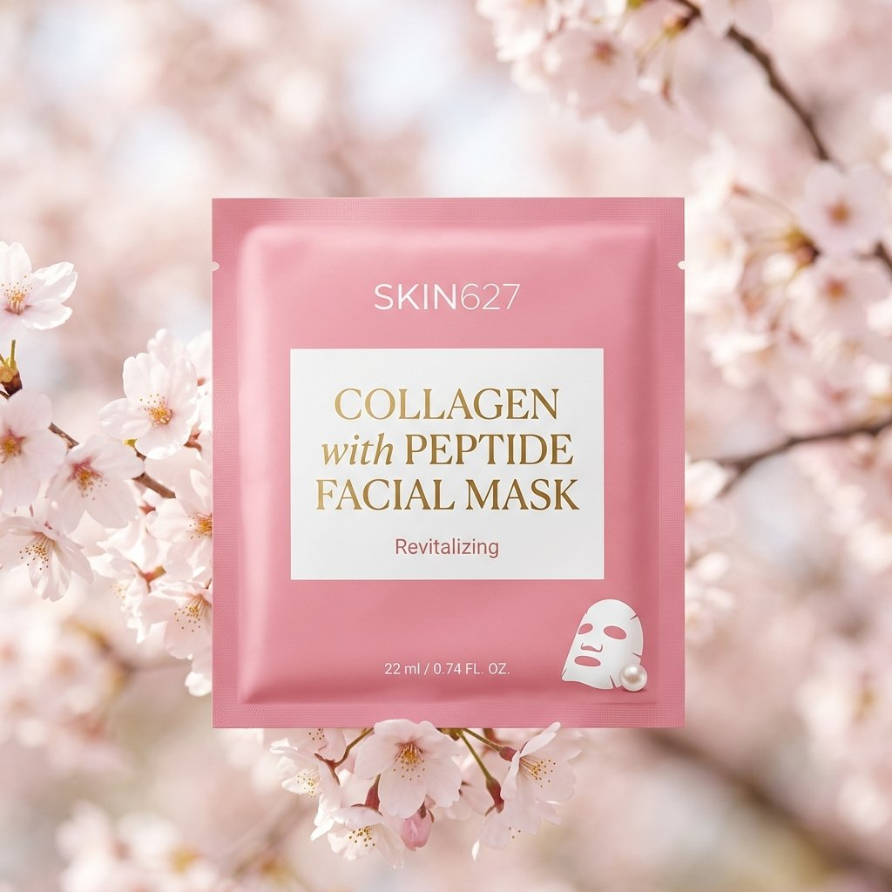</a></td>
<td align="center"><video src="https://github.com/user-attachments/assets/880c0019-e45a-4eb9-be6f-638ff71a0e0f" width="400" controls></video></td>
</tr></table>

**Pasos:**

1. Ingresa imagenes de producto.
2. Genera la escena principal.
3. Define movimiento y estructura.
4. Estilo y restricciones

> [!NOTE]
> Esto difiere del Caso 15 (comercial de lujo) en que comienza con fotos de producto existentes en lugar de generar todo desde cero. Ideal para vendedores de e-commerce que ya tienen imagenes de producto y quieren convertirlas en anuncios de video rapidamente.


## 🎨 Animacion y Personaje

<!-- Case 3: Character Sheet → Animation (by @YaReYaRu30Life) -->
### Caso 3: [Hoja de Personaje → Animacion](https://x.com/YaReYaRu30Life/status/2047203375314571501) (por [@YaReYaRu30Life](https://x.com/YaReYaRu30Life))

Genera una hoja de tres vistas del personaje (frente, lado, espalda) con GPT Image 2, luego usala como ancla para la animacion en Seedance 2.0. Ideal para personajes de anime, personajes de juegos y revelaciones de figuras.

<table><tr>
<td align="center"><a href="https://evolink.ai/gpt-image-2-prompts?utm_source=github&utm_medium=picture&utm_campaign=gptimage2-x-seedance2"></a></td>
<td align="center"><a href="https://evolink.ai/gpt-image-2-prompts?utm_source=github&utm_medium=picture&utm_campaign=gptimage2-x-seedance2"></a></td>
<td align="center"><a href="https://evolink.ai/gpt-image-2-prompts?utm_source=github&utm_medium=picture&utm_campaign=gptimage2-x-seedance2"></a></td>
</tr></table>

<table><tr>
<td align="center"><a href="https://evolink.ai/gpt-image-2-prompts?utm_source=github&utm_medium=picture&utm_campaign=gptimage2-x-seedance2"></a></td>
<td align="center"><video src="https://github.com/user-attachments/assets/92a0aa56-441f-40db-b9c9-13410254cb3f" width="400" controls></video></td>
</tr></table>

**Pasos:**

1. Dibujo de tres vistas (personaje) + dos dibujos de tres vistas de equipamiento. Basandose en esto, prepara dibujos de tres vistas con cada pieza de equipamiento equipada en una sola imagen. Por razones de conteo de publicacion de imagenes, el adjunto del personaje se omite
2. Crea un storyboard basado en este dibujo de tres vistas  
3. Convierte el storyboard en video usando Seedance2.0

**Prompt de GPT Image 2:**

```
Create a storyboard based on this three-view drawing  
```

**Prompt de Seedance 2.0:**

```
Turn the storyboard into video using Seedance2.0
```


<!-- Case 4: Anime OP Style Video (by @Toshi_nyaruo_AI) -->
### Caso 4: [Video Estilo OP de Anime](https://x.com/Toshi_nyaruo_AI/status/2047216971184546231) (por [@Toshi_nyaruo_AI](https://x.com/Toshi_nyaruo_AI))

Usa GPT Image 2 para construir una imagen de ambientacion de escena, luego deja que Seedance 2.0 anime libremente. Comparar resultados restringidos (guiados por storyboard) y de forma libre (solo prompt) ayuda a decidir el enfoque correcto por toma.

<table><tr>
<td align="center"><a href="https://evolink.ai/gpt-image-2-prompts?utm_source=github&utm_medium=picture&utm_campaign=gptimage2-x-seedance2"></a></td>
<td align="center"><video src="https://github.com/user-attachments/assets/f08a2fee-89a7-4c7c-a58a-f1306f87419a" width="280" controls></video></td>
<td align="center"><video src="https://github.com/user-attachments/assets/09d81a41-b5c5-47f3-8c67-442b7a93b019" width="280" controls></video></td>
</tr></table>

**Pasos:**

1. Grok inventa letras para un opening ficticio de anime
2. Se uso GPT-image2 para convertir las letras en un storyboard
3. Se usa seedance2 para generar videos

**Prompt de GPT Image 2:**

```
turn the lyrics into a storyboard
```

**Prompt de Seedance 2.0:**

```
Japanese full-color anime, fast cuts, high frame count, 24fps. Dark fantasy anime OP style. Epic battle between protagonist and massive supernatural creatures. High-impact sequence of scenes. Only [character name] appears.
```

> [!NOTE]
> Cuando Seedance anima libremente (sin una referencia de storyboard), los resultados pueden ser mas dinamicos pero menos consistentes con tu imagen fuente. Usa el control de storyboard para tomas clave de personajes y animacion libre para secuencias de accion.


<!-- Case 12: Claude Code + Character Sheet → Animation (by @old_pgmrs_will) -->
### Caso 12: [Claude Code × Hoja de Personaje → Animacion](https://x.com/old_pgmrs_will/status/2045091769180914019) (por [@old_pgmrs_will](https://x.com/old_pgmrs_will))

Usa Claude Code para escribir la construccion del mundo y la historia del personaje, luego pasa descripciones estructuradas a GPT Image 2 para generar el visual clave del personaje, y despues anima con Seedance 2.0. Flujo de trabajo amigable para desarrolladores para la creacion de IP original. 191 likes / 7K vistas.

<table><tr>
<td align="center"><a href="https://evolink.ai/seedance2?utm_source=github&utm_medium=picture&utm_campaign=gptimage2-x-seedance2">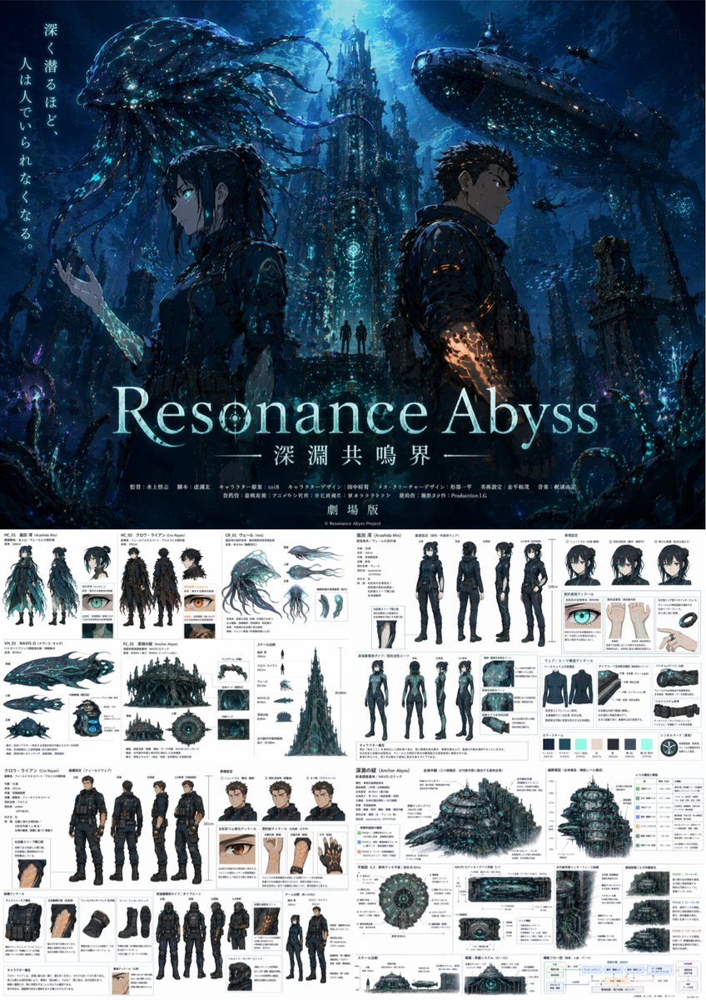</a></td>
</tr></table>

**Pasos:**

1. Usa Claude Code para redactar notas de construccion del mundo y una especificacion estructurada del personaje (nombre, apariencia, personalidad, ambientacion)
2. Alimenta la especificacion del personaje directamente en GPT Image 2 para generar un visual clave o hoja de personaje
3. Usa el visual clave como imagen de referencia en Seedance 2.0 y anima

> [!NOTE]
> Claude Code produce texto estructurado — especificaciones de personajes, descripciones de escenas, esquemas de dialogos — que GPT Image 2 maneja bien como prompts detallados. Este pipeline es particularmente efectivo para IP de historias originales: construye la historia en codigo, visualizala en GPT Image 2, animala en Seedance.


<!-- Case 13: Dance Sequence Grid → Dance Video (by @Ciri_ai) -->
### Caso 13: [Cuadricula de Secuencia de Baile → Video de Baile](https://x.com/Ciri_ai/status/2049034340160704643) (por [@Ciri_ai](https://x.com/Ciri_ai))

Genera una cuadricula 4×4 de poses de baile con GPT Image 2, luego alimentala a Seedance 2.0 como referencia de movimiento. El modelo lee la cuadricula como una secuencia coreografica y produce un video de baile continuo. Variante avanzada: sube multiples referencias de personaje para transiciones de vestuario sincronizadas con el ritmo. 161 likes / 9K vistas.

<table><tr>
<td align="center"><a href="https://evolink.ai/gpt-image-2-prompts?utm_source=github&utm_medium=picture&utm_campaign=gptimage2-x-seedance2">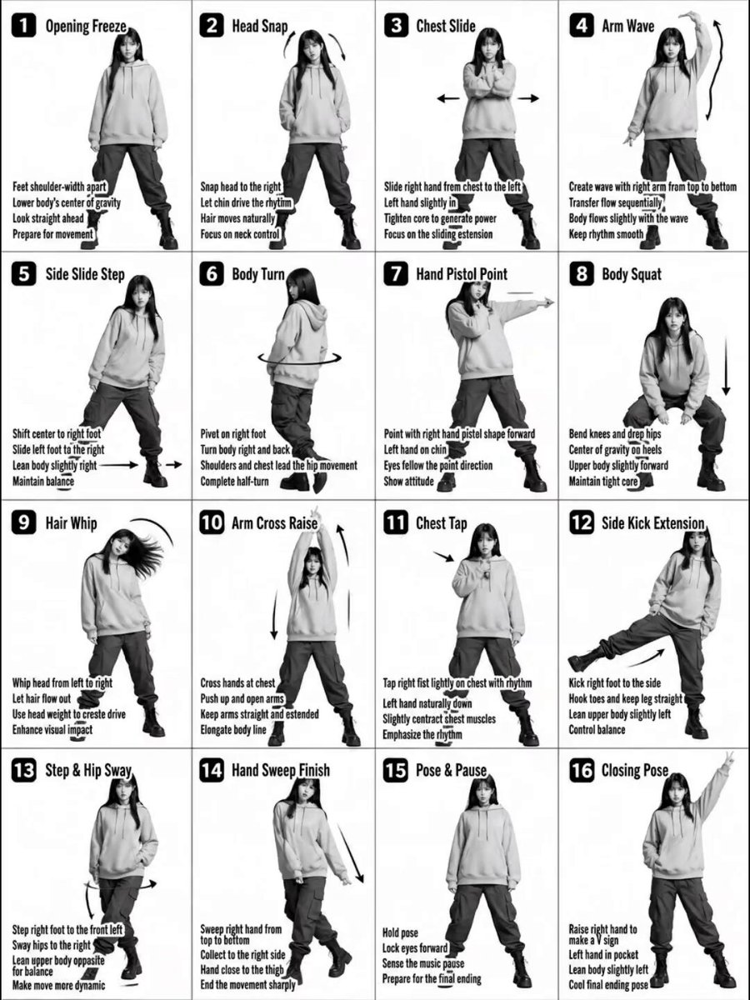</a></td>
<td align="center"><video src="https://github.com/user-attachments/assets/39376245-e7c7-4812-b770-9e81acf4eca2" width="400" controls></video></td>
</tr></table>

**Pasos:**

1. Genera una imagen de cuadricula 4×4 mostrando un personaje en poses de baile secuenciales con GPT Image 2
2. Sube la cuadricula como imagen de referencia en Seedance 2.0
3. Indica a Seedance que siga la secuencia de baile de la imagen de referencia
4. (Avanzado) Sube el personaje con Vestuario A, el personaje con Vestuario B y la cuadricula de baile como tres referencias para transiciones de vestuario durante el baile

**Prompt de GPT Image 2:**

```
Transform the input image into a stylized K-pop dance tutorial poster with a fashion-forward streetwear aesthetic, keeping the exact 4x4 grid layout (16 panels) and choreography structure.
Core Composition
Maintain a 16-panel grid (4 columns × 4 rows) with clean spacing

Each panel shows the same female dancer performing sequential choreography

Preserve panel numbering (1–16) in bold, modern UI-style labels

Keep step titles and instructional captions, but redesign typography to feel like K-pop album graphics / dance practice overlays

Subject Styling (K-pop Idol Inspired)

Young female dancer with soft glam K-pop makeup (dewy skin, subtle shimmer, defined eyes)

Hair: long, sleek, slightly dynamic (motion-friendly, flowing during moves)

Expression: confident, charismatic stage presence

Outfit (streetwear-inspired):

Cropped hoodie or oversized zip-up jacket

Cargo pants or parachute pants with straps

Chunky sneakers or platform boots

Optional accessories: chain necklace, ear cuffs, fingerless gloves

Visual Style

Switch from plain grayscale → high-contrast + soft neon accents

Base palette: black, white, gray

Accent colors: neon pink, electric blue, or violet glow (subtle, not overpowering)

Lighting:

Studio lighting with a soft glow + rim light effect

Slight stage-light vibe, like a K-pop dance practice video

Graphics & Effects

Add dynamic motion trails and glow accents on arms, legs, and hair movement

Replace basic arrows with stylized motion graphics (neon strokes, swooshes)

Subtle light streaks or particle effects for energy

Optional faint floor reflection or glossy surface

Typography

Titles: bold, modern, slightly condensed sans-serif (K-pop album style)

Add subtle glow or gradient to titles

Instruction text: clean, minimal, slightly futuristic UI style

Panel numbers: inside rounded squares or pill shapes with neon outline

Camera & Framing

Full-body framing in each panel (consistent scale)

Straight-on angle, but with slight dynamic tilt or perspective energy

Maintain clarity of movement for instructional purpose

Mood & Energy

Feels like a K-pop dance practice meets fashion editorial

Clean but energetic

Stylish, rhythmic, performance-driven

Important Constraints

Keep choreography readable and sequential

Do NOT merge panels or change layout

Maintain consistency of dancer identity across all panels
```

**Prompt de Seedance 2.0:**

```
Character from Image 1 performs the dance based on the breakdown in Image 3. Midway through the performance, they switch outfits on beat into the character from Image 2. Then, the character from Image 2 continues and completes the remaining dance steps from Image 3. Emphasize precise beat synchronization with the music
```

> [!NOTE]
> Esta tecnica funciona para cualquier secuencia de movimiento — baile, artes marciales, deportes. La cuadricula 4×4 le da a Seedance 16 cuadros de referencia para interpolar, produciendo un movimiento mas suave que con menos paneles.
>
> **Variantes de la comunidad:** [@airina_xyz](https://x.com/airina_xyz/status/2049830199236190326) demostro el flujo de trabajo basico con un bailarin callejero urbano. [@Kashberg_0](https://x.com/Kashberg_0/status/2049697925262102689) uso tableros de personajes + cuadros de referencia de movimiento para coreografia K-Pop (52 likes / 2K vistas).


<!-- Case 14: Comic Page → Animated Video (by @nimentrix) -->
### Caso 14: [Pagina de Comic → Video Animado](https://x.com/nimentrix/status/2049560412979708334) (por [@nimentrix](https://x.com/nimentrix))

Crea una pagina de comic multi-panel con GPT Image 2 — diseno diagonal, globos de dialogo, narrativa cinematografica — luego anima toda la pagina en un video con Seedance 2.0. El modelo lee los paneles del comic como una secuencia narrativa y produce un cortometraje animado continuo. 330 likes / 21K vistas / 360 marcadores.

<table><tr>
<td align="center"><strong>Entradas de GPT Image 2</strong><br><a href="https://evolink.ai/gpt-image-2-prompts?utm_source=github&utm_medium=picture&utm_campaign=gptimage2-x-seedance2">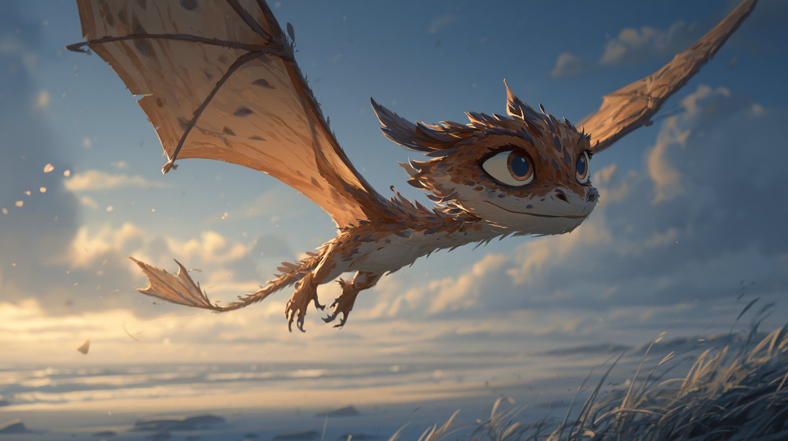</a></td>
<td align="center"><br><a href="https://evolink.ai/gpt-image-2-prompts?utm_source=github&utm_medium=picture&utm_campaign=gptimage2-x-seedance2">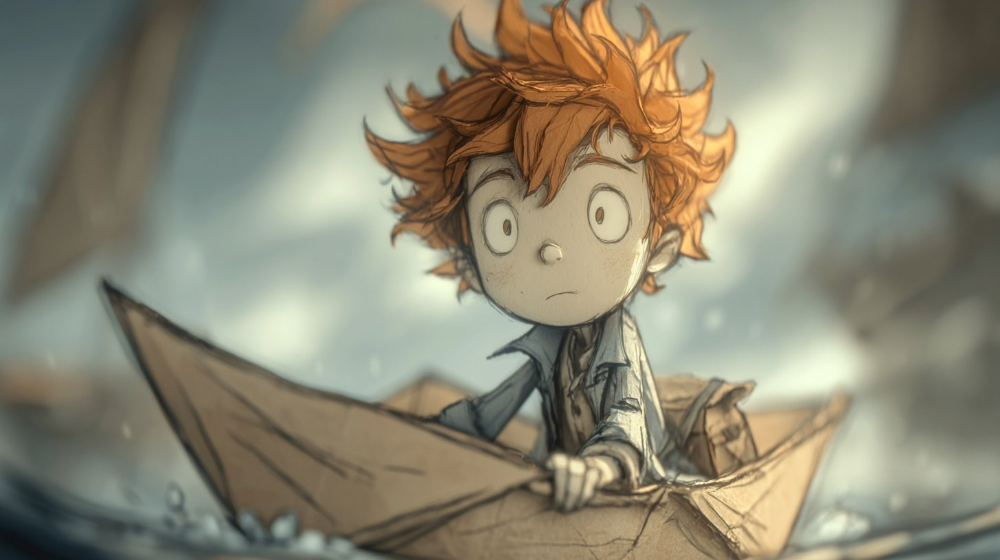</a></td>
<td align="center"><strong>Entrada de Seedance 2.0</strong><br><a href="https://evolink.ai/gpt-image-2-prompts?utm_source=github&utm_medium=picture&utm_campaign=gptimage2-x-seedance2">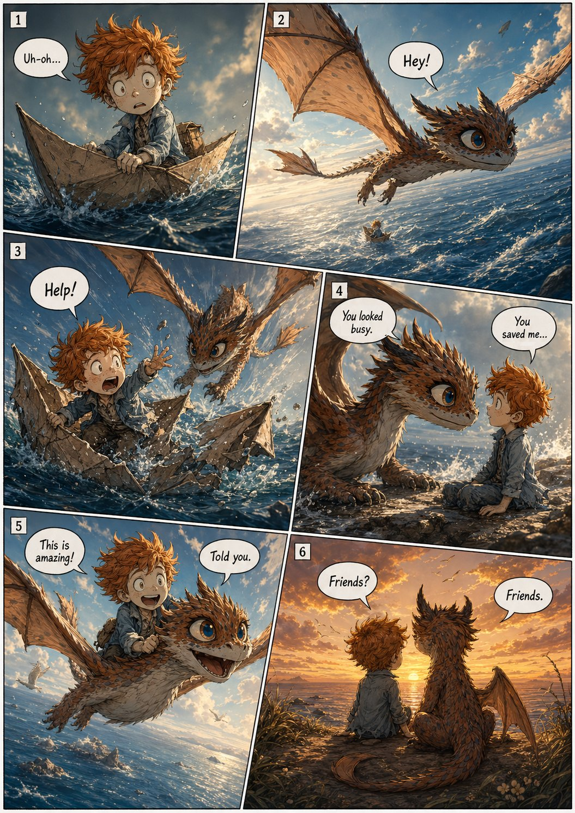</a></td>
</tr></table>

<table><tr>
<td align="center"><video src="https://github.com/user-attachments/assets/0b5038e2-dfca-4c65-b5d7-a719a74408b0" width="400" controls></video></td>
</tr></table>

**Pasos:**

1. Crea una hoja de diseno de personaje (vistas frontal, lateral, trasera) con GPT Image 2 para fijar la apariencia del personaje
2. Genera una pagina de comic multi-panel usando el personaje como referencia
3. Importa la pagina de comic a Seedance 2.0 y anima

**Prompt de GPT Image 2 — Hoja de personaje:**

```
Create a character design style sheet for [describe your character]:
front view, side view, back view on white background.
Make the aspect ratio 4:3.
```

**Prompt de GPT Image 2 — Pagina de comic:**

```
[Character description] and [companion], american comic multi-panel illustration,
diagonal layout, six panels, cinematic storytelling, clear reading flow, with speech bubbles.
[Describe the story sequence across panels.]
```

**Prompt de Seedance 2.0:**

```
Animate this comic page as a cinematic sequence. Follow the panel order from top-left to bottom-right.
Smooth transitions between panels, maintain character consistency, cinematic camera movement.
```

> [!NOTE]
> El diseno diagonal y los globos de dialogo le dan a Seedance indicaciones visuales claras para los limites de los paneles y el orden de lectura. Para mejores resultados, manten la accion de cada panel simple y distinta. Este flujo de trabajo tambien combina bien con Suno para agregar una banda sonora al video final.


<!-- Case 25: K-Pop Choreography with Detailed Control (by @Kashberg_0) -->
### Caso 25: [Coreografia K-Pop — Control Detallado](https://x.com/Kashberg_0/status/2049839091899088948) (por [@Kashberg_0](https://x.com/Kashberg_0))

Maximo control sobre la animacion de baile: escribe un desglose coreografico de 16 pasos con descripciones precisas de movimiento, genera la cuadricula de referencia con GPT Image 2, luego anima con Seedance 2.0. Cada paso obtiene 2–3 segundos, produciendo un video de baile continuo de 35–50 segundos con calidad de movimiento K-pop autentica.

<table><tr>

<td align="center"><video src="https://github.com/user-attachments/assets/1c088b5e-6305-4bf6-9377-97784d5f8fac" width="400" controls></video></td>
</tr></table>

**Pasos:**

1. Escribe una secuencia coreografica detallada (16 pasos con movimientos de baile especificos)
2. Genera una cuadricula de referencia mostrando cada paso con GPT Image 2
3. Alimenta la cuadricula + la descripcion completa de la coreografia en Seedance 2.0
4. El modelo sigue la secuencia de pasos con transiciones suaves


**Prompt de Seedance 2.0:**

```
K-Pop Dance Sequence (16 Steps, Korean Street)
[PROJECT TYPE]
Cinematic K-pop dance video (instruction-to-performance translation)
[CORE REQUIREMENT — STRICT]
The video must faithfully follow the exact 16-step choreography shown in the reference sheet, in the same order, with accurate poses and transitions.
No steps added, removed, or rearranged.
🧍‍♀️ [CHARACTER]
Korean female dancer (K-pop idol aesthetic)
Slim, athletic build
Same consistent face and proportions throughout
Expressive, confident stage presence
Natural, fluid but sharp K-pop movement quality
👕 [WARDROBE — K-POP STYLE]
Fitted crop top
Loose high-waisted jeans
Sneakers
Modern idol styling (clean, trendy)
Fabric reacts naturally to movement (denim weight, subtle folds)
📍 [LOCATION / ENVIRONMENT]
Empty aesthetic Korean street (Seoul-inspired)
Clean urban design: narrow street, minimal signage, soft architecture
No people, no vehicles
Slight cinematic depth (buildings, street lights, textures)
Lighting:
Soft daylight or golden hour (ideal for K-pop vibe)
Balanced highlights + gentle shadows
🔢 [16-STEP CHOREOGRAPHY — LOCKED SEQUENCE]
Starting Pose
Step Touch Right
Step Touch Left
Hip Sway Combo
Body Roll Down
Back Step Sweep
Quarter Turn Pivot
Hair Flip & Pose
Side Step Drag
Cross Behind Unwind
Body Wave Up
Hip Circle
Step Lock Step
Arm Sweep Pose
Chest Pop & Hit
Final Pose (hold 2–3 sec)
🎥 [CAMERA DIRECTION]
Full-body framing at all times
Start: centered wide shot
Smooth tracking + subtle dolly movement
Slight angle variation (front → 3/4 → side for spins)
No fast cuts — continuous flow
Camera movement complements choreography, not distracts
💃 [MOVEMENT STYLE — IMPORTANT]
Authentic K-pop choreography feel
Mix of:
Sharp hits (chest pop, accents)
Smooth transitions (body waves, turns)
Clean isolations (hips, chest, arms)
Controlled spins, balanced footwork
No jitter, no unnatural speed
⏱️ [TIMING]
Each step: ~2–3 seconds
Total duration: ~35–50 seconds
Seamless transitions between steps
🎵 [MUSIC DIRECTION — VERY IMPORTANT]
Genre: K-pop / K-pop instrumental / dance-pop
Tempo: 100–115 BPM
Style:
Clean beat drops
Punchy percussion
Light synth melodies
Modern idol choreography vibe
Sync Notes:
Step transitions hit beats
Step 8 (Hair Flip) hits a musical accent
Step 15 (Chest Pop) synced with a strong beat hit
Final pose lands on a clean musical ending
🎨 [VISUAL STYLE]
Photorealistic
Slightly stylized K-pop MV tone
Soft cinematic grading
Clean, polished, high-end look
⚙️ [OUTPUT SETTINGS]
4K resolution
24–30 FPS
High motion clarity
No distortion, no artifacts
🚫 [RESTRICTIONS]
No extra dancers
No background crowd
No outfit changes
No deviation from choreography
No camera cuts that break continuity
```

> [!NOTE]
> Cuanto mas especificas sean tus descripciones de pasos, mejor seguira Seedance la coreografia. Nombra movimientos de baile reales (body roll, hair flip, chest pop) en lugar de descripciones vagas. Esta tecnica tambien funciona para kata de artes marciales, flujos de yoga o cualquier movimiento secuencial.


<!-- Case 27: Character Intro Animation (by @0xbisc) -->
### Caso 27: [Animacion de Presentacion de Personaje](https://x.com/0xbisc/status/2049496584283656690) (por [@0xbisc](https://x.com/0xbisc))

Crea una animacion de presentacion de personaje estilo juego AAA cyberpunk. Toma cualquier imagen de personaje, redisenala como personaje de juego con GPT Image 2, genera una pantalla de intro cinematografica, luego anima la revelacion con Seedance 2.0. Intercambia cualquier personaje — el flujo de trabajo es agnostico al personaje. 55 likes / 3K vistas.

<table><tr>
<td align="center"><a href="https://evolink.ai/gpt-image-2-prompts?utm_source=github&utm_medium=picture&utm_campaign=gptimage2-x-seedance2"></a></td>
<td align="center"><video src="https://github.com/user-attachments/assets/e52eaa0b-b2fa-4c35-b790-a92af05d0c82" width="400" controls></video></td>
</tr></table>

**Pasos:**

1. Comienza con una imagen de personaje (tu propio arte, foto o generada por IA)
2. Usa GPT Image 2 para redisenar como personaje de juego AAA cyberpunk — mantiene la identidad facial, mejora el estilo
3. Genera una pantalla de intro cinematografica con el personaje (fondo oscuro, iluminacion dramatica, diseno de tarjeta de titulo)
4. Anima la revelacion de intro en Seedance 2.0

**Prompt de GPT Image 2 — Rediseno de personaje:**

```
based on the provided image, redesign as a cyberpunk AAA game character, keep face identity, keep original outfit, hyper-realistic game character, near-photoreal but still game-rendered, cinematic realism, in-game cutscene quality, cinematic lighting, strong contrast, realistic materials, depth of field, subject in sharp focus, background slightly blurred, strong foreground-background separation, Night City inspired environment, dense futuristic megacity, neon signage, wet streets, reflections, industrial details, fully human appearance, clean natural skin, no mechanical lines, no implants, no cyber patterns, character holding a highly designed futuristic weapon, dynamic action-ready pose, confident and intense expression, 16:9 AAA key visual, strong composition, character dominant, no logo, generate a unique character name fitting the character personality, character name in graffiti-style typography, medium-to-small size, integrated into layout, not dominant, refined character info module, editorial layout style, minimal, no background panel, only 1–2 short traits, extremely concise labels, grid-aligned typography-driven layout, Cyberpunk style UI, neon yellow text only, flat geometric layout, strict alignment, only one info module, no additional graphics, clean image, no heavy grain, no film grain, smooth surfaces, high polish, no anime, illustration, raw photography, metallic UI, gold color, cluttered layout, dense UI, boxes, background panels, color blocks, arrows, mechanical skin lines, cyber patterns

```

**Prompt de Seedance 2.0:**

```
industrial cyberpunk city at night, wet reflective ground, neon lights, distant explosions, floating sparks, cinematic atmosphere
camera always follows the character closely, no cuts, smooth tracking
motion continuity, no pose popping, no animation snapping, physically coherent transitions
0–2s:
character transitions into a low sliding movement
one hand brushing the ground for balance
sparks and debris react dynamically
weapon rotates forward in a smooth, deliberate motion
brief partial slow motion to emphasize control and flow
2–5s:
character raises weapon and fires while still moving forward
stylized compressed slow motion:
muzzle flash expands in layered light
face and muscles illuminated
subtle controlled recoil
shell casings eject in short slow-motion beats
particles and light distort around the shot
eyes focused strictly on target direction
final precise shot lands near the end of this phase
strong forward impact implied (sparks / explosion burst)
5–7s:
character motion fully stops, body settles naturally into final stance
character remains still, only subtle breathing motion
character lifts head and turns toward camera for the first time, then holds eye contact steadily
camera performs a subtle push-in
UI takes full visual focus:
UI builds progressively over the entire duration:
light glitch and scan effects
elements align into a clean layout
character name appears in graffiti handwritten animation, stroke-by-stroke reveal
secondary UI fades and slides in smoothly
```

> [!NOTE]
> Este flujo de trabajo es agnostico al personaje — intercambia cualquier personaje (anime, realista, estilizado) y el pipeline se adapta. La clave es el proceso de dos pasos de GPT Image 2: primero redisena el personaje para el estilo objetivo, luego compone el diseno de la pantalla de intro.


## 🎵 Video Musical y Cortometraje

<!-- Case 7: Music Video with Suno (by @fukaborichannel) -->
### Caso 7: [Video Musical con Suno](https://x.com/fukaborichannel/status/2047206670020055317) (por [@fukaborichannel](https://x.com/fukaborichannel))

Combinacion de tres herramientas: GPT Image 2 para visuales, Seedance 2.0 para movimiento, Suno para musica. Produce la musica primero para fijar el tempo y la estructura, luego disena storyboards que se alineen al ritmo.

<table><tr>
<td align="center"><a href="https://evolink.ai/gpt-image-2-prompts?utm_source=github&utm_medium=picture&utm_campaign=gptimage2-x-seedance2">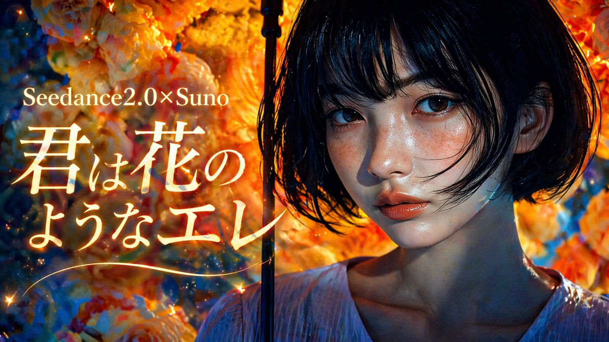</a></td>
<td align="center"><a href="https://evolink.ai/gpt-image-2-prompts?utm_source=github&utm_medium=picture&utm_campaign=gptimage2-x-seedance2">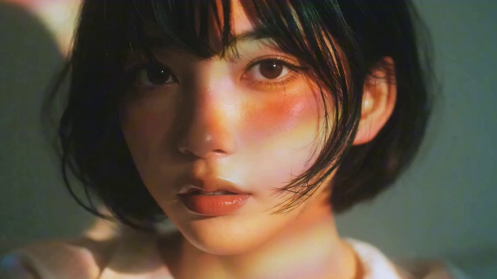</a></td>
<td align="center"><video src="https://github.com/user-attachments/assets/fd4be5c7-cd02-4a77-ae07-6b80efeff201" width="280" controls></video></td>
</tr></table>

**Pasos:**

1. Genera la musica del estilo objetivo en Suno — confirma la estructura de la cancion (intro / verso / coro)
2. Disena paneles de storyboard por seccion de la cancion en GPT Image 2
3. Anima cada panel en Seedance 2.0 — ajusta la duracion del clip al ritmo
4. Sincroniza los clips con la pista musical en tu software de edicion


> [!NOTE]
> Produce la musica primero. Conocer el tempo y la duracion antes de disenar el storyboard te permite ajustar con precision el tiempo de los paneles a los cortes del ritmo.


<!-- Case 8: Cyberpunk Style Short Film (by @ponyodong) -->
### Caso 8: [Cortometraje Estilo Cyberpunk](https://x.com/ponyodong/status/2047210987263230133) (por [@ponyodong](https://x.com/ponyodong))

Usa GPT Image 2 para establecer un estilo visual consistente (cyberpunk, neon, linternas, estetica femenina), luego anima cada imagen con Seedance 2.0 para producir un cortometraje estilizado que se situa entre fondo de pantalla, poster y apertura de historia.

<table><tr>
<td align="center"><a href="https://evolink.ai/gpt-image-2-prompts?utm_source=github&utm_medium=picture&utm_campaign=gptimage2-x-seedance2"></a></td>
<td align="center"><video src="https://github.com/user-attachments/assets/db6ebb63-90dc-47c5-96c5-ab2fa53ed56d" width="280" controls></video></td>
</tr></table>

**Pasos:**

1. Define el sistema de estilo visual en GPT Image 2 — fija colores, iluminacion y apariencia del personaje
2. Genera 4–6 imagenes que lleven el mismo ambiente
3. Anima cada imagen en Seedance 2.0 con prompts de movimiento lento y atmosferico
4. Secuencia los clips para construir una narrativa visual corta


<!-- Case 11: Japanese MV Full Toolchain (by @Tz_2022) -->
### Caso 11: [MV Japones — Toolchain Completo de IA](https://x.com/Tz_2022/status/2047684399404056609) (por [@Tz_2022](https://x.com/Tz_2022))

Pipeline de cuatro herramientas que produce un video musical completo de estilo japones: GPT Image 2 para visuales → Seedance 2.0 para movimiento → Suno 5.5 para musica → CapCut para edicion final. 742 likes / 107K vistas.

<table><tr>
<td align="center"><video src="https://github.com/user-attachments/assets/e5ce621c-7fa3-47b5-99a7-00df7741a651" width="400" controls></video></td>
</tr></table>

**Pasos:**

1. Genera la musica en Suno 5.5 primero — fija la duracion, tempo y ambiente de la cancion
2. Disena paneles de storyboard en GPT Image 2 sincronizados con las secciones de la cancion
3. Anima cada panel en Seedance 2.0, ajustando la duracion del clip al ritmo
4. Importa los clips de video y la pista de Suno a CapCut — sincroniza y exporta


> [!NOTE]
> Produce la musica primero — conocer la estructura del ritmo antes de disenar los storyboards te permite ajustar con precision el tiempo de los paneles a los cortes de la cancion. Esto extiende el Caso 7 (MV City Pop) agregando Suno al ciclo y tratando todo el pipeline como una produccion sincronizada en lugar de un ensamblaje posterior.


<!-- Case 20: Claude Shotlist → MV (by @CoffeeVectors) -->
### Caso 20: [Shotlist de Claude → Video Musical](https://x.com/CoffeeVectors/status/2049592150581485757) (por [@CoffeeVectors](https://x.com/CoffeeVectors))

Usa Claude para generar una lista de tomas detallada (15 clips de un segundo con diferentes angulos de camara y acciones), genera un unico retrato con GPT Image 2, luego produce cada toma con Seedance 2.0. Edita los clips juntos con tu propia musica de Suno para un MV completo. La IA escribe la direccion creativa — tu solo ejecutas.

<table><tr>
<td align="center"><a href="https://evolink.ai/gpt-image-2-prompts?utm_source=github&utm_medium=picture&utm_campaign=gptimage2-x-seedance2">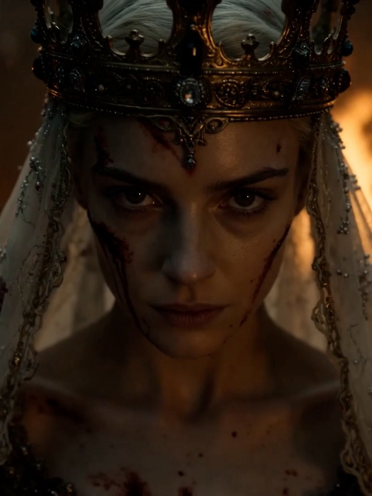</a></td>
<td align="center"><video src="https://github.com/user-attachments/assets/d6ba86c4-65c3-4b1d-aa3c-846667f53b5e" width="400" controls></video></td>
</tr></table>

**Pasos:**

1. Genera un unico retrato de personaje con GPT Image 2 como ancla visual
2. Pide a Claude que escriba una lista de 15 tomas (una toma por segundo) con angulos y acciones variados
3. Alimenta el retrato + cada descripcion de toma en Seedance 2.0 por separado
4. Edita todos los clips juntos y sincroniza con tu pista musical


**Prompt de Seedance 2.0 (por toma):**

```
A 15-second prestige-TV sequence, one shot per second, scored to an apocalyptic sacred crescendo — low organ and dissonant brass through roaring choir, hammered bells, and earth-shaking timpani to a final shattering harmonic strike. Throughout: a pale young queen with white hair, a tall ornate gold filigree crown, a translucent gauze veil, and a heavily jeweled pale gown — channeler of divine fire from above. Shot entirely handheld — visible micro-shake, breath-rhythm sway, reactive whip-corrections to action, documentary-tense framing.
1 (0–1s) Sky Opens. Handheld wide low-angle, camera tilted up. Black clouds spiral and split in a tear of white-gold light. She stands small below. Organ slams.
2 (1–2s) Eyes To Heaven. Handheld tight close-up, slight float. Her eyes lifted, gold light on her face, a tear of fire tracking down her cheek. Choir enters.
3 (2–3s) Hand Raised. Handheld medium, slight push-in. She raises one palm to the sky. Clouds above twist toward her gesture. Strings climb.
4 (3–4s) First Bolt. Handheld wide. A colossal pillar of holy fire descends and splits a distant black tower. Camera jolts on impact. Hammer beat.
5 (4–5s) The Pointing. Handheld tight medium. She extends one ringed finger slowly toward the horizon. Camera barely breathing. Bells ring.
6 (5–6s) Bolts Rain. Handheld wide, panning to track strikes. Dozens of pillars of holy fire descend across a battlefield. Camera whips reactively to each impact. Drums hammer.
7 (6–7s) Cloaked In Light. Handheld low-angle medium. A shaft of holy fire engulfs her without burning. Camera trembles in the pressure wave. Choir doubles.
8 (7–8s) The Wicked Burn. Handheld tight medium. A robed figure raises a blade — consumed in white-gold fire from above, ash silhouette collapsing. Camera flinches with the strike. Bass hit.
9 (8–9s) Walking Forward. Handheld tracking wide, operator moving with her. She advances across cracked scorched earth, pillars of fire descending in her wake. Strings shriek.
10 (9–10s) Crown Of Lightning. Handheld tight on the crown, slight float. White-gold lightning arcs continuously between the spires. Hair lifts in charged air. Bells climb.
11 (10–11s) Closed Fist. Handheld tight close-up. Her hand closes slowly into a fist. Vast clap of thunder. Camera shakes hard. Sustained held chord.
12 (11–12s) The Cleansing. Handheld wide, operator on a high vantage with visible sway. A fortified city struck by a grid of descending holy fire pillars. She stands small below, untouched. Choir at full roar.
13 (12–13s) The Quiet After. Handheld medium, breathing slowly. She lowers her hand. The storm stills. Ash falls like snow around her. Music drops to near-silence.
14 (13–14s) Eyes Return. Handheld extreme close-up, slight float. Eyes still warm gold blink once slowly. Faintest exhale. Single sustained tone.
15 (14–15s) The Smiting. Handheld frontal wide at dusk, settling into stillness on the final hold. She stands at the center of a vast scorched circle, horizon reduced to smoking ruin. Torn sky still glowing above her. Final shattering harmonic strike sustains.

Style: Photorealistic dark holy fantasy, prestige-TV aesthetic. Anamorphic 35mm, shallow DoF, heavy volumetric atmosphere — smoke, ash, ember haze, heat distortion, charged air shimmer. Palette of scorched bone-white, ivory, ash-gray, storm-slate, and incandescent white-gold. Painterly compositions, fine detail against destruction, organic film grain, heavy highlight bloom on the divine fire. Handheld throughout — visible micro-shake, reactive whip-corrections, breath-rhythm sway, camera flinching with every impact. No tripod stillness until the final hold. Operatic, terrifying, sovereign. The sky itself as her instrument.
```

> [!NOTE]
> Este flujo de trabajo separa la direccion creativa (Claude) de la ejecucion visual (GPT Image 2 + Seedance). Es particularmente efectivo para videos musicales donde necesitas muchas tomas variadas del mismo personaje. El retrato unico como ancla mantiene la consistencia en los 15 clips.


## 🎮 Concepto de Juego

<!-- Case 9: Game & Interactive Content (by @AbleGPT) -->
### Caso 9: [Juego y Contenido Interactivo](https://x.com/op7418/status/2046854932620525750) (por [@op7418](https://x.com/op7418))

Usa GPT Image 2 para generar imagenes de UI estilo juego (con elementos HUD, barras de habilidades, superposiciones de opciones), luego animalas en Seedance 2.0 para simular secuencias de juego interactivas. Los estilos de juego e ilustracion enfrentan menos restricciones de contenido en Seedance que el metraje humano realista.

<table><tr>
<td align="center"><a href="https://evolink.ai/gpt-image-2-prompts?utm_source=github&utm_medium=picture&utm_campaign=gptimage2-x-seedance2">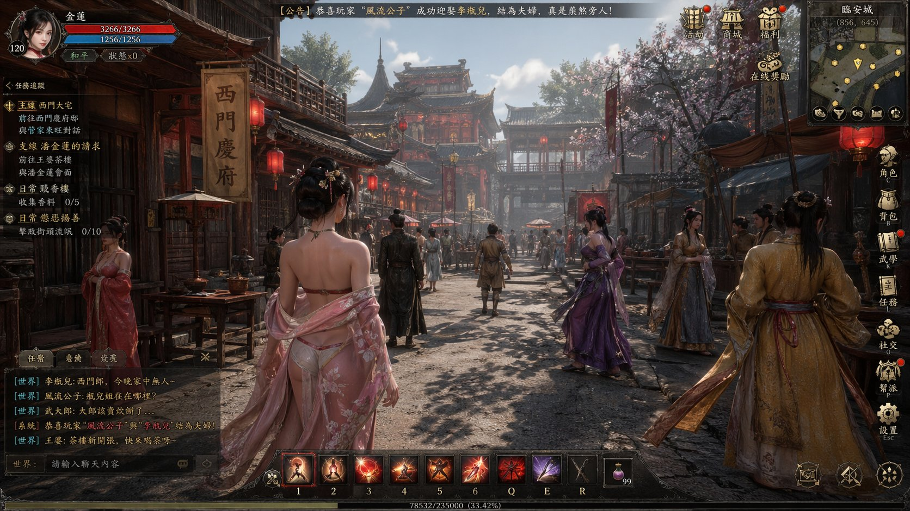</a></td>
<td align="center"><video src="https://github.com/user-attachments/assets/3d5d7525-b469-4c3b-aab9-68dc47630fdd" width="400" controls></video></td>
</tr></table>

**Pasos:**

1. Genera imagenes estilo ARPG o UI de juego con GPT Image 2, incluyendo elementos HUD
2. Importa a Seedance 2.0 y describe la interaccion o secuencia de combate
3. Agrega efectos de post-produccion (particulas, brillo) para pulir

**Prompt de GPT Image 2-2:**

```
帮我生成一个以《金瓶梅》为主题的古代 ARPG MMO 开放世界游戏的截图
```
**Prompt de GPT Image 2-2:**
```
出现 UI 选择 UI 之后变成第二张图的场景图
```

**Prompt de Seedance 2.0:**

```
选择 UI 之后变成第二张图右边的场景
```

**Variante — Simulacion de Juego ARPG (por [@0xbisc](https://x.com/0xbisc/status/2047315350862352715)):**

One Piece, Stranger Things, cualquier IP — genera una captura de pantalla de juego de un mundo que no existe, luego expandelo en gameplay en vivo con Seedance 2.0. 934 likes / 125K vistas.

<table><tr>
<td align="center"><video src="https://github.com/user-attachments/assets/983b433a-88ea-4843-9047-fc01396752fe" width="400" controls></video></td>
</tr></table>

**Prompt de GPT Image 2:**

```
Generate an ARPG dialogue game screenshot inspired by [film/series name]
```

**Seedance 2.0:** Usa el modo Imagen-a-Video. No se necesita prompt — Seedance lee el diseno del HUD y lo extiende en una secuencia de gameplay automaticamente.

> [!NOTE]
> Seedance 2.0 tiene restricciones sobre contenido humano realista. Los estilos de juego, anime e ilustracion evitan la mayoria de estas limitaciones y ofrecen mas rango creativo.


<!-- Case 17: Game Interface Animation Full Pipeline (by @0xInk_) -->
### Caso 17: [Animacion de Interfaz de Juego — Pipeline Completo](https://x.com/0xInk_/status/2048809000121360649) (por [@0xInk_](https://x.com/0xInk_))

El flujo de trabajo mas viral de esta coleccion: crea una animacion completa de interfaz de videojuego desde cero. Comienza con un personaje 2D en Midjourney, convierte a aspecto 3D listo para juego con GPT Image 2, disena la UI completa del juego (HUD, pantallas de carga, menus), luego anima todo con Seedance 2.0. GPT Image 2 destaca aqui porque maneja detalles de UI y permite retrabajo iterativo sin perdida de calidad. 2280 likes / 208K vistas / 2793 marcadores.

<table><tr>
<td align="center"><a href="https://evolink.ai/gpt-image-2-prompts?utm_source=github&utm_medium=picture&utm_campaign=gptimage2-x-seedance2"></a></td>
<td align="center"><video src="https://github.com/user-attachments/assets/b83da8f3-3dd6-44a3-bb27-b0d59cab381a" width="400" controls></video></td>
</tr></table>


> [!NOTE]
> La idea clave: GPT Image 2 te permite retrabajar una imagen multiples veces sin degradacion de calidad — perfecto para iterar en disenos de UI. Construye la interfaz completa del juego como una serie de pantallas estaticas, luego deja que Seedance las conecte en una animacion fluida.


<!-- Case 24: GTA-Style City Game Concept (by @markgadala) -->
### Caso 24: [Concepto de Juego de Ciudad Estilo GTA](https://x.com/markgadala/status/2048560337960489385) (por [@markgadala](https://x.com/markgadala))

Crea cualquier version de GTA que quieras en 5 minutos. Genera capturas de pantalla de UI de juego ambientadas en cualquier ciudad (Tokio, Lagos, Mumbai) con GPT Image 2, luego anima en metraje de gameplay con Seedance 2.0. El resultado parece un trailer real de un juego que no existe. 99 likes / 8.7K vistas.

<table><tr>
<td align="center"><video src="https://github.com/user-attachments/assets/d3b0a7b9-827a-47f6-b24e-eabfacf3e892" width="400" controls></video></td>
</tr></table>

**Pasos:**

1. Define tu variante de GTA — ciudad, epoca, estilo visual
2. Genera capturas de pantalla de juego con GPT Image 2: vista en tercera persona, superposicion de HUD, entorno urbano
3. Importa a Seedance 2.0 y anima como metraje de gameplay
4. Ensambla los clips en un trailer


> [!NOTE]
> Esto extiende el enfoque de concepto de juego del Caso 9 a juegos de mundo abierto urbano especificamente. Los elementos del HUD (minimapa, barra de salud, estrellas de busqueda) son lo que vende la ilusion de "juego real". Funciona para cualquier ciudad — cuanto mas especificos sean tus detalles a nivel de calle, mas convincente sera el resultado.


## 🛠 Herramientas de Produccion

<!-- Case 18: Single Agent Automated Workflow (by @venturetwins) -->
### Caso 18: [Flujo de Trabajo Automatizado con Agente Unico](https://x.com/venturetwins/status/2048526911056613586) (por [@venturetwins](https://x.com/venturetwins))

El enfoque de esfuerzo cero: dile a un unico agente de IA (como Glif) lo que quieres, y el maneja todo el pipeline — generando el storyboard con GPT Image 2 y animandolo con Seedance 2.0 — en una sola conversacion. Sin transferencias manuales de archivos, sin ingenieria de prompts por paso. 934 likes / 70K vistas.

<table><tr>
<td align="center"><a href="https://evolink.ai/gpt-image-2-prompts?utm_source=github&utm_medium=picture&utm_campaign=gptimage2-x-seedance2"></a></td>
<td align="center"><video src="https://github.com/user-attachments/assets/cc01849d-ee9b-47af-a7b0-d13250a001e0" width="400" controls></video></td>
</tr></table>


<!-- Case 21: Casting Grid Actor Audition (by @8fstudioz) -->
### Caso 21: [Cuadricula de Casting — Audicion de Actores](https://x.com/8fstudioz/status/2049547426198151627) (por [@8fstudioz](https://x.com/8fstudioz))

Ahorra creditos auditando 4 actores en una sola generacion. Genera una cuadricula de casting de 4 paneles con GPT Image 2 mostrando diferentes actores para el mismo rol, luego prueba cada uno en Seedance 2.0 con la misma linea de dialogo. Descubre que actor vale la pena gastar mas creditos antes de comprometerte con un video completo.

<table><tr>
<td align="center"><a href="https://evolink.ai/gpt-image-2-prompts?utm_source=github&utm_medium=picture&utm_campaign=gptimage2-x-seedance2">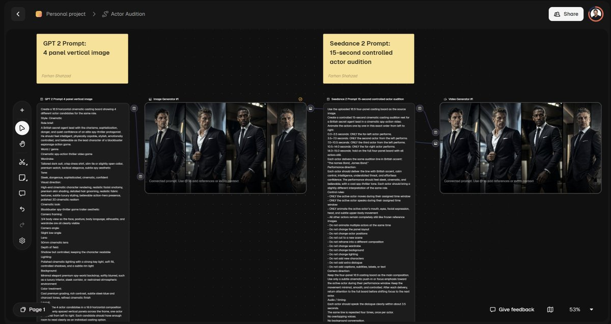</a></td>
<td align="center"><video src="https://github.com/user-attachments/assets/dcdd958f-70cd-43f6-b191-4e0715fe2472" width="400" controls></video></td>
</tr></table>

**Pasos:**

1. Genera una cuadricula de casting de 4 paneles con GPT Image 2 — mismo rol, 4 actores diferentes
2. Prueba cada actor individualmente en Seedance 2.0 con el mismo dialogo y accion
3. Compara la calidad de actuacion (contacto visual, expresion, movimiento)
4. Invierte los creditos restantes solo en el actor ganador

**Prompt de GPT Image 2:**

```
Create a 16:9 horizontal cinematic casting board showing 4 different actor candidates for the same role.

Style:
[INSERT VISUAL STYLE]
Examples: CGI AAA video game cinematic, photorealistic, anime, stylized 3D

Role brief:
[INSERT ROLE DESCRIPTION]
Describe the type of lead or character the user is casting for.

World / genre:
[INSERT WORLD OR GENRE]
Examples: spy-action thriller, fantasy RPG, sci-fi adventure, crime drama

Wardrobe:
[INSERT WARDROBE DESCRIPTION]
Describe the clothing or outfit direction all 4 actors should share.

Tone:
[INSERT TONE]
Examples: sleek, dangerous, adventurous, grounded, moody, confident

Visual direction:
[INSERT VISUAL RENDERING NOTES]
Describe the rendering quality, material detail, realism level, facial detail, costume detail, and overall look.

Cinematic look:
[INSERT CINEMATIC STYLE]
Examples: blockbuster trailer aesthetic, prestige drama look, AAA game cinematic look

Camera framing:
[INSERT FRAMING]
Examples: 3/4 body, full body, waist-up

Camera angle:
[INSERT CAMERA ANGLE]
Examples: eye-level, slight low angle, slight 3/4 angle

Lens:
[INSERT LENS]
Examples: 50mm cinematic lens, 85mm portrait lens

Depth of field:
[INSERT DEPTH OF FIELD]
Examples: shallow, shallow but controlled

Lighting:
[INSERT LIGHTING SETUP]
Describe the lighting style.

Background:
[INSERT BACKGROUND DESCRIPTION]
Describe the background environment or backdrop.

Colour treatment:
[INSERT COLOUR TREATMENT]
Describe the grading or colour tone.

Layout:
Arrange the 4 actor candidates in a 16:9 horizontal composition with 4 evenly spaced vertical panels across the frame, one actor per panel from left to right.

Character variation:
Each candidate should feel like a different casting choice for the same role. Vary facial structure, age feel, hairstyle, expression, posture, and energy, but keep them grounded in the same world, wardrobe logic, and tonal universe.

Important:
- Same role
- Same world
- Same wardrobe logic
- Same visual style
- Different actor interpretations
- No duplicated faces
- No text
- No labels
- No watermark

The final image should feel like a premium cinematic casting board for [INSERT PROJECT TYPE].
Examples: a film, a game, an animated short, a cinematic trailer
```

**Prompt de Seedance 2.0 (por actor):**

```
Use the uploaded 16:9 four-panel casting board as the source image.

Create a controlled 15-second cinematic casting audition reel for [INSERT ROLE OR PROJECT TYPE].

Animate the actors one by one in this exact order from left to right:

0.0–3.5 seconds: ONLY the far-left actor performs.
3.5–7.0 seconds: ONLY the second actor from the left performs.
7.0–10.5 seconds: ONLY the third actor from the left performs.
10.5–14.0 seconds: ONLY the far-right actor performs.
14.0–15.0 seconds: hold on the full four-panel board with all actors still.

Each actor delivers the same audition line:
"[INSERT DIALOGUE LINE]"

Performance direction:
Each actor should look directly into the camera while delivering the line, as if performing a screen test audition. Their eye line should stay locked to camera.

Each actor should deliver the line with:
[INSERT PERFORMANCE TRAITS]
Examples: calm control, quiet menace, emotional vulnerability, confidence, charm, intensity, humor

The performance should feel:
[INSERT PERFORMANCE TONE]
Examples: sleek, cinematic, believable, grounded, dramatic, stylized

Each actor should bring a slightly different interpretation of the same role.

Control rules:
ONLY the active actor moves during their assigned time window.
ONLY the active actor speaks during their assigned time window.
ONLY animate the active actor's mouth, eyes, facial expression, head, and subtle upper-body movement.
The active actor must look directly at the camera while speaking.
All other actors remain completely still like frozen reference images.
Do not animate multiple actors at the same time.
Do not change the panel layout.
Do not change actor positions.
Do not cut to a new scene.
Do not reframe into a different composition.
Do not change wardrobe.
Do not change background.
Do not change lighting.
Do not add new characters.
Do not add extra dialogue.
Do not add captions, subtitles, labels, or text.

Camera direction:
Keep the four-panel 16:9 casting board as the main composition. Use only [INSERT CAMERA MOVEMENT STYLE] toward the active actor during their performance window.
Examples: a subtle cinematic push-in, gentle focus emphasis, minimal controlled emphasis

Keep the movement [INSERT CAMERA BEHAVIOUR].
Examples: minimal, smooth, controlled

Keep the actor presented toward camera so the audition feels direct and comparable.

Audio / timing:
Each actor should speak the dialogue clearly within about 3.5 seconds.
The same line is repeated four times, once per actor.
No overlapping voices.
No background conversation.
No unnecessary sound effects.

Final result:
A clean casting audition reel where four actor candidates perform the same line one by one from left to right, each looking directly into the camera, making it easy to compare screen presence, facial acting, eye contact, posture, and dialogue delivery.
```

> [!NOTE]
> Un personaje puede verse genial en una imagen fija pero perder completamente el rol una vez que pruebas dialogo, contacto visual y actuacion. Este flujo de trabajo adelanta la decision de casting antes de gastar creditos en escenas completas.


<!-- Case 22: 3D Sculpt → AI Render → Animation (by @_DAntunes_) -->
### Caso 22: [Escultura 3D → Render IA → Animacion](https://x.com/_DAntunes_/status/2049142166232904078) (por [@_DAntunes_](https://x.com/_DAntunes_))

Conecta el modelado 3D tradicional con el video de IA: crea un modelo de arcilla 3D basico en Nomad Sculpt (o cualquier app de escultura), usa GPT Image 2 para renderizarlo en una ilustracion pulida, luego anima con Seedance 2.0 via ComfyUI. Esto te da control preciso sobre la pose y composicion que los prompts de texto puro no pueden lograr.

<table><tr>
<td align="center"><video src="https://github.com/user-attachments/assets/f5ecdb0c-d1ca-4291-91bc-eb88de91cd82" width="400" controls></video></td>
</tr></table>

**Pasos:**

1. Esculpe un modelo 3D basico en Nomad Sculpt (o Blender, ZBrush, etc.)
2. Exporta una captura de pantalla del modelo desde el angulo de camara deseado
3. Usa GPT Image 2 para renderizar el modelo 3D en una ilustracion pulida o imagen realista
4. Importa la imagen renderizada a Seedance 2.0 (via ComfyUI o directo) y anima

> [!NOTE]
> El modelo 3D te da algo que ningun prompt de texto puede: control exacto sobre la pose del cuerpo, posicion de las manos y angulo de camara. Incluso un modelo de arcilla basico es suficiente — GPT Image 2 se encarga de todo el renderizado y trabajo de detalle. Este pipeline es ideal para creadores que ya usan herramientas 3D y quieren agregar animacion de IA a su flujo de trabajo.


## 🌟 Galería de la Comunidad

Una selección continua de trabajos con **GPT Image 2 × Seedance 2.0** compartidos por creadores en X. Haz clic en cualquier video para reproducirlo; haz clic en el nombre del autor para abrir la publicación original. Las incorporaciones más recientes aparecen primero.

<table><tr>
<td align="center" valign="top" width="25%">
<video src="https://github.com/user-attachments/assets/cd87bc68-5613-410e-8dbe-df656aaa504d" width="240" controls></video>
<br/><a href="https://x.com/abxxai/status/2055636095736709190"><b>@abxxai</b></a> · <sub>80,365 views</sub>
<br/><sub>You can literally create anything with AI right now.</sub>
</td>
<td align="center" valign="top" width="25%">
<video src="https://github.com/user-attachments/assets/fd7dac8a-0984-416d-8632-72ecd3106586" width="240" controls></video>
<br/><a href="https://x.com/pabloprompt/status/2055726656287871478"><b>@pabloprompt</b></a> · <sub>75,035 views</sub>
<br/><sub>One Piece BTS · PART 2 😍</sub>
</td>
<td align="center" valign="top" width="25%">
<video src="https://github.com/user-attachments/assets/6ae8904b-6510-4aa5-ba8f-12ab001669ec" width="240" controls></video>
<br/><a href="https://x.com/maarcoofdezz/status/2057371189207584943"><b>@maarcoofdezz</b></a> · <sub>30,023 views</sub>
<br/><sub>Just made a full cinematic ad for a luxury mens cologne usi…</sub>
</td>
<td align="center" valign="top" width="25%">
<video src="https://github.com/user-attachments/assets/484aa607-4d00-4543-95d0-7838fe7ce0db" width="240" controls></video>
<br/><a href="https://x.com/AIwithAliya/status/2055674114845925710"><b>@AIwithAliya</b></a> · <sub>24,084 views</sub>
<br/><sub>This looks so neat and clean</sub>
</td>
</tr></table>

<table><tr>
<td align="center" valign="top" width="25%">
<video src="https://github.com/user-attachments/assets/0c2f7cf0-f7e1-4f52-b7b7-e53c179fcc0d" width="240" controls></video>
<br/><a href="https://x.com/HeyOz_AI/status/2057871032480825398"><b>@HeyOz_AI</b></a> · <sub>17,459 views</sub>
<br/><sub>Claude + GPT Image 2 + seedance + Meta ads MCP Replaced my…</sub>
</td>
<td align="center" valign="top" width="25%">
<video src="https://github.com/user-attachments/assets/77e02dda-8b51-4654-8af2-1bbb93f822d6" width="240" controls></video>
<br/><a href="https://x.com/Creatify_AI/status/2056431801971999147"><b>@Creatify_AI</b></a> · <sub>16,350 views</sub>
<br/><sub>Creatify AI agents use the BEST AI models for each process.</sub>
</td>
<td align="center" valign="top" width="25%">
<video src="https://github.com/user-attachments/assets/3adf863a-165b-4d3e-bb20-e427cd3ce648" width="240" controls></video>
<br/><a href="https://x.com/MayorKingAI/status/2057933848948965741"><b>@MayorKingAI</b></a> · <sub>14,113 views</sub>
<br/><sub>I created a steampunk action sequence in a hand-painted 3D…</sub>
</td>
<td align="center" valign="top" width="25%">
<video src="https://github.com/user-attachments/assets/800f2bbc-d53b-4075-8e08-b63a2e69c3e3" width="240" controls></video>
<br/><a href="https://x.com/IATheYoker/status/2057402859222933891"><b>@IATheYoker</b></a> · <sub>12,503 views</sub>
<br/><sub>GPT Image 2 + Seedance 2.5 ya pueden crear intros del Mundi…</sub>
</td>
</tr></table>

<table><tr>
<td align="center" valign="top" width="25%">
<video src="https://github.com/user-attachments/assets/008d22d8-9a47-4051-ab60-7743958cc4c8" width="240" controls></video>
<br/><a href="https://x.com/ShamiWeb3/status/2055832098435629466"><b>@ShamiWeb3</b></a> · <sub>9,644 views</sub>
<br/><sub>A TAPNOW luxury skincare visual in which a glowing beauty m…</sub>
</td>
<td align="center" valign="top" width="25%">
<video src="https://github.com/user-attachments/assets/592c1944-d3bf-4db6-b546-f152a836081d" width="240" controls></video>
<br/><a href="https://x.com/GlitterPixely/status/2057903405712953505"><b>@GlitterPixely</b></a> · <sub>8,862 views</sub>
<br/><sub>Quick character highlight intro with GPT Image 2 + Seedance…</sub>
</td>
<td align="center" valign="top" width="25%">
<video src="https://github.com/user-attachments/assets/4467f8e3-192a-4937-95a6-1945122a6d66" width="240" controls></video>
<br/><a href="https://x.com/luche_whitewing/status/2055626188241150350"><b>@luche_whitewing</b></a> · <sub>7,837 views</sub>
<br/><sub>深夜の美女👠 lovart (@lovart_jp)× 🎬 GPT-image-2 × Seedance 2.0 で作…</sub>
</td>
<td align="center" valign="top" width="25%">
<video src="https://github.com/user-attachments/assets/4d6c8938-e4a2-4bf6-ab16-e7a2ed4d8205" width="240" controls></video>
<br/><a href="https://x.com/DoctorAmna11/status/2057108821537861739"><b>@DoctorAmna11</b></a> · <sub>6,903 views</sub>
<br/><sub>The Ghost Who Couldn’t Scare Anyone</sub>
</td>
</tr></table>

<table><tr>
<td align="center" valign="top" width="25%">
<video src="https://github.com/user-attachments/assets/ec26a6f4-f6ca-4a4b-bc68-3c11d818982d" width="240" controls></video>
<br/><a href="https://x.com/I_amShiti/status/2057378173856494070"><b>@I_amShiti</b></a> · <sub>5,830 views</sub>
<br/><sub>One AI app gives you access to👇</sub>
</td>
<td align="center" valign="top" width="25%">
<video src="https://github.com/user-attachments/assets/f7323047-0d46-4cba-945f-e8199a837787" width="240" controls></video>
<br/><a href="https://x.com/eijo_AIart/status/2056935787581898972"><b>@eijo_AIart</b></a> · <sub>5,028 views</sub>
<br/><sub>PolloAI GPT-Image2 x Seedance2で、映画製作用ストーリーボードを使った、ショートフィルム制…</sub>
</td>
<td align="center" valign="top" width="25%">
<video src="https://github.com/user-attachments/assets/01aa8296-2c8c-4c99-a915-2bbdc9232125" width="240" controls></video>
<br/><a href="https://x.com/aziz4ai/status/2057824424838004836"><b>@aziz4ai</b></a> · <sub>4,885 views</sub>
<br/><sub>JADE FALCON: AWAKENING</sub>
</td>
<td align="center" valign="top" width="25%">
<video src="https://github.com/user-attachments/assets/70eea8b8-d3fa-4555-9c60-52ed8bed4711" width="240" controls></video>
<br/><a href="https://x.com/opener_ai/status/2055627299429777684"><b>@opener_ai</b></a> · <sub>4,353 views</sub>
<br/><sub>Gpt image 2 x Seedance 2.0 @dreamina_ai</sub>
</td>
</tr></table>

<table><tr>
<td align="center" valign="top" width="25%">
<video src="https://github.com/user-attachments/assets/014d3a33-b68a-4977-8f72-a239b65a835c" width="240" controls></video>
<br/><a href="https://x.com/spect3ral/status/2057871834310148242"><b>@spect3ral</b></a> · <sub>4,319 views</sub>
<br/><sub>Claude + GPT Image 2 + Seedance + Meta Ads MCP</sub>
</td>
<td align="center" valign="top" width="25%">
<video src="https://github.com/user-attachments/assets/2f8d430d-fd0f-4d1b-9c74-92f85fa466b2" width="240" controls></video>
<br/><a href="https://x.com/mdmadeit/status/2055685500279697883"><b>@mdmadeit</b></a> · <sub>3,970 views</sub>
<br/><sub>made a full 1:25 anime short</sub>
</td>
<td align="center" valign="top" width="25%">
<video src="https://github.com/user-attachments/assets/ea9bbdfd-a5b1-4e85-a886-362362f6e3cb" width="240" controls></video>
<br/><a href="https://x.com/Strength04_X/status/2055849751317524982"><b>@Strength04_X</b></a> · <sub>3,737 views</sub>
<br/><sub>Created this cinematic sushi 🍣storyboard with GPT Image 2 +…</sub>
</td>
<td align="center" valign="top" width="25%">
<video src="https://github.com/user-attachments/assets/595b4af8-ece2-4cca-98df-982721e685bd" width="240" controls></video>
<br/><a href="https://x.com/jasminekhan90_/status/2057399215228322261"><b>@jasminekhan90_</b></a> · <sub>3,418 views</sub>
<br/><sub>Human connection still matters in an AI future.</sub>
</td>
</tr></table>

<table><tr>
<td align="center" valign="top" width="25%">
<video src="https://github.com/user-attachments/assets/6e646b59-7485-470d-af4e-de983dda6b12" width="240" controls></video>
<br/><a href="https://x.com/Sogni_Protocol/status/2057822871817191549"><b>@Sogni_Protocol</b></a> · <sub>3,342 views</sub>
<br/><sub>There’s no better combo on the market right now than GPT Im…</sub>
</td>
<td align="center" valign="top" width="25%">
<video src="https://github.com/user-attachments/assets/28bb17d7-6fc0-4f94-8716-8b5871a290ea" width="240" controls></video>
<br/><a href="https://x.com/noorlewisx/status/2055863201389240369"><b>@noorlewisx</b></a> · <sub>2,974 views</sub>
<br/><sub>Made with Seedance 2 + GPT Image 2</sub>
</td>
<td align="center" valign="top" width="25%">
<video src="https://github.com/user-attachments/assets/b265ac7b-fb01-4e4c-954c-f4ab748f7fc4" width="240" controls></video>
<br/><a href="https://x.com/markgadala/status/2055896597662228650"><b>@markgadala</b></a> · <sub>2,876 views</sub>
<br/><sub>AI makes creating Pixar quality animations so incredibly ea…</sub>
</td>
<td align="center" valign="top" width="25%">
<video src="https://github.com/user-attachments/assets/f4c4152c-15d0-404b-8040-f86d54ecbc28" width="240" controls></video>
<br/><a href="https://x.com/SocialSight/status/2057334346223177973"><b>@SocialSight</b></a> · <sub>2,720 views</sub>
<br/><sub>did you get the news?</sub>
</td>
</tr></table>

<table><tr>
<td align="center" valign="top" width="25%">
<video src="https://github.com/user-attachments/assets/4ba27b9b-0431-419e-90fe-6a25816979c5" width="240" controls></video>
<br/><a href="https://x.com/hanifproduktif/status/2055828657172820269"><b>@hanifproduktif</b></a> · <sub>2,595 views</sub>
<br/><sub>Replaced (GPT Image 2 + Seedance 2.5)</sub>
</td>
<td align="center" valign="top" width="25%">
<video src="https://github.com/user-attachments/assets/11375c25-a923-44a1-a8a4-8d04acecab31" width="240" controls></video>
<br/><a href="https://x.com/adrianaia_/status/2057474538594607520"><b>@adrianaia_</b></a> · <sub>2,382 views</sub>
<br/><sub>De las calles frías a un salón de clases lleno de amor.</sub>
</td>
<td align="center" valign="top" width="25%">
<video src="https://github.com/user-attachments/assets/0dd27e90-469f-4ee8-aebb-3f3afbf2d8f2" width="240" controls></video>
<br/><a href="https://x.com/itsPolloAI/status/2057333580133724593"><b>@itsPolloAI</b></a> · <sub>2,153 views</sub>
<br/><sub>🎉 Pollo AI × GPT Image 2 × Seedance 2.0 — Results are in.</sub>
</td>
<td align="center" valign="top" width="25%">
<video src="https://github.com/user-attachments/assets/c62c2125-a2c4-4e3a-9e99-e6f94124086c" width="240" controls></video>
<br/><a href="https://x.com/SimplyAnnisa/status/2058068924806160785"><b>@SimplyAnnisa</b></a> · <sub>2,026 views</sub>
<br/><sub>Golden mornings and buttery saltbread bliss</sub>
</td>
</tr></table>

<table><tr>
<td align="center" valign="top" width="25%">
<video src="https://github.com/user-attachments/assets/7e1d91f7-0153-4b5d-ac13-ae62da10f517" width="240" controls></video>
<br/><a href="https://x.com/Artedeingenio/status/2057401307510481397"><b>@Artedeingenio</b></a> · <sub>1,479 views</sub>
<br/><sub>Using Niji to create children’s illustrations, GPT Image 2…</sub>
</td>
<td align="center" valign="top" width="25%">
<video src="https://github.com/user-attachments/assets/5a72d57d-f9fb-42a4-8e15-2de535d3b6a8" width="240" controls></video>
<br/><a href="https://x.com/hasamaru_studio/status/2057433716339933656"><b>@hasamaru_studio</b></a> · <sub>1,461 views</sub>
<br/><sub>GPT Image 2 でショットリストを作成し、 Seedance 2.0 のリファレンス生成で動画を作成しました。</sub>
</td>
<td align="center" valign="top" width="25%"></td>
<td align="center" valign="top" width="25%"></td>
</tr></table>

<table><tr>
<td align="center" valign="top" width="25%">
<video src="https://github.com/user-attachments/assets/35c556af-1752-4a8a-9965-d1e2314b242e" width="240" controls></video>
<br/><a href="https://x.com/Pixelbunny_ai/status/2051985506414768154"><b>@Pixelbunny_ai</b></a>
<br/><sub>- Create Stunning AAA quality shorts with leading models -…</sub>
</td>
<td align="center" valign="top" width="25%">
<video src="https://github.com/user-attachments/assets/75051d48-988e-4e0d-9cfa-389d821abec8" width="240" controls></video>
<br/><a href="https://x.com/Adam38363368936/status/2051969842748735596"><b>@Adam38363368936</b></a>
<br/><sub>GPT image 2+Seedance 2</sub>
</td>
<td align="center" valign="top" width="25%">
<video src="https://github.com/user-attachments/assets/8241abd7-3b4e-4b62-8dca-24dac31926cc" width="240" controls></video>
<br/><a href="https://x.com/ai_hakase_/status/2051950389063282894"><b>@ai_hakase_</b></a>
<br/><sub>【AIでNetflix級のUIを爆速生成！GPT Image 2 × Seedance 2.0】 👉   最新のAIを…</sub>
</td>
<td align="center" valign="top" width="25%">
<video src="https://github.com/user-attachments/assets/30710ea7-1f06-49b2-ad31-041fa95046c2" width="240" controls></video>
<br/><a href="https://x.com/Hoshimiko_AIart/status/2051947486353433013"><b>@Hoshimiko_AIart</b></a>
<br/><sub>「見たいアニメに間に合わない……！！」</sub>
</td>
</tr></table>

<table><tr>
<td align="center" valign="top" width="25%">
<video src="https://github.com/user-attachments/assets/8315ea16-32ff-4078-8dce-44d4d2c896d9" width="240" controls></video>
<br/><a href="https://x.com/Dheer_Red/status/2051915196185346333"><b>@Dheer_Red</b></a>
<br/><sub>Seedance 2.0, Veo 3.1, Nano Banana, GPT Image 2—all in one…</sub>
</td>
<td align="center" valign="top" width="25%">
<video src="https://github.com/user-attachments/assets/c57c7caf-ab27-4c79-9ca6-b571d7899139" width="240" controls></video>
<br/><a href="https://x.com/NyaiiBubu/status/2051914243193389078"><b>@NyaiiBubu</b></a>
<br/><sub>AI for UGC modal Rp0 itu nyata 😭</sub>
</td>
<td align="center" valign="top" width="25%">
<video src="https://github.com/user-attachments/assets/1899a3a5-da5c-455b-8fa3-d3c3ab830df4" width="240" controls></video>
<br/><a href="https://x.com/apoorvabr/status/2051904397324722349"><b>@apoorvabr</b></a>
<br/><sub>I like the video concepts of @chrisfirst.</sub>
</td>
<td align="center" valign="top" width="25%">
<video src="https://github.com/user-attachments/assets/1718996f-d0e8-4ba8-abef-1d0e725ed22f" width="240" controls></video>
<br/><a href="https://x.com/MaAyyoub/status/2051900019444154376"><b>@MaAyyoub</b></a>
<br/><sub>Don't ruin a new day by thinking about yesterday.</sub>
</td>
</tr></table>

<table><tr>
<td align="center" valign="top" width="25%">
<video src="https://github.com/user-attachments/assets/a7d5b81e-708e-4bb5-9263-7bfb9c6e0d01" width="240" controls></video>
<br/><a href="https://x.com/halne369/status/2051867032333803722"><b>@halne369</b></a>
<br/><sub>Seedance2.0用の絵コンテ作成のスキルができました！</sub>
</td>
<td align="center" valign="top" width="25%">
<video src="https://github.com/user-attachments/assets/4a76e9c0-0171-4b2a-a74d-90f3e59f80e8" width="240" controls></video>
<br/><a href="https://x.com/RYD232210555420/status/2051847984053469424"><b>@RYD232210555420</b></a>
<br/><sub>朋友设计的无人驾驶公交车 Sumgo，我帮它做了条 AI 概念宣传片。</sub>
</td>
<td align="center" valign="top" width="25%">
<video src="https://github.com/user-attachments/assets/ac2e370f-6986-4ac1-b2ec-9580901d9483" width="240" controls></video>
<br/><a href="https://x.com/Lart_AI/status/2051838590016241772"><b>@Lart_AI</b></a>
<br/><sub>🎮 Built with GPT Image 2 × Seedance 2.0 on LartAI!</sub>
</td>
<td align="center" valign="top" width="25%">
<video src="https://github.com/user-attachments/assets/ad9b0494-b689-4aad-8a50-bcd278110c8b" width="240" controls></video>
<br/><a href="https://x.com/Jake_Joseph/status/2051774091108155844"><b>@Jake_Joseph</b></a>
<br/><sub>Wait, you can put real screenshots inside AI-generated UGC…</sub>
</td>
</tr></table>

<table><tr>
<td align="center" valign="top" width="25%">
<video src="https://github.com/user-attachments/assets/661be30d-946d-42f6-888c-fc19d8ab6e9d" width="240" controls></video>
<br/><a href="https://x.com/KimAkiyama81/status/2051768139566714958"><b>@KimAkiyama81</b></a>
<br/><sub>Choreographing a hallway action scene using GPT Image 2 and…</sub>
</td>
<td align="center" valign="top" width="25%">
<video src="https://github.com/user-attachments/assets/6735dd89-bc7d-462e-8f5f-69fab82158e7" width="240" controls></video>
<br/><a href="https://x.com/ChangningL29508/status/2051743657980748119"><b>@ChangningL29508</b></a>
<br/><sub>Use the same storyboard to generate a realistic character r…</sub>
</td>
<td align="center" valign="top" width="25%">
<video src="https://github.com/user-attachments/assets/d3d201fc-0813-4d08-aab0-eb0d7a27f708" width="240" controls></video>
<br/><a href="https://x.com/aiseomastery/status/2051733667106734129"><b>@aiseomastery</b></a>
<br/><sub>THIS AI WORKFLOW TURNS A RAMEN RECIPE INTO A STUNNING ANIME…</sub>
</td>
<td align="center" valign="top" width="25%">
<video src="https://github.com/user-attachments/assets/ae6c44a0-8e6a-4ff1-ab1f-99b7aa49af01" width="240" controls></video>
<br/><a href="https://x.com/simplissimus_/status/2051714965485039897"><b>@simplissimus_</b></a>
<br/><sub>Quer dominar a Força e ver sua própria versão Jedi ganhar v…</sub>
</td>
</tr></table>

<table><tr>
<td align="center" valign="top" width="25%">
<video src="https://github.com/user-attachments/assets/67479af0-384f-471f-a8ef-4ee4727289f0" width="240" controls></video>
<br/><a href="https://x.com/azed_ai/status/2051693299376021888"><b>@azed_ai</b></a>
<br/><sub>Studios sell this as pre-production</sub>
</td>
<td align="center" valign="top" width="25%">
<video src="https://github.com/user-attachments/assets/1800bbc0-e6f2-4289-9d41-ef07c15be380" width="240" controls></video>
<br/><a href="https://x.com/fy360593/status/2051686764054790504"><b>@fy360593</b></a>
<br/><sub>Been seeing a lot of people doing this "Fan cam" content la…</sub>
</td>
<td align="center" valign="top" width="25%">
<video src="https://github.com/user-attachments/assets/954dc98f-ab00-4fd5-9106-8671310958ef" width="240" controls></video>
<br/><a href="https://x.com/indrawan_ape/status/2051680370429685963"><b>@indrawan_ape</b></a>
<br/><sub>GPT Image 2 × Seedance 2.0 on @higgsfield is insane.</sub>
</td>
<td align="center" valign="top" width="25%">
<video src="https://github.com/user-attachments/assets/fbf50a8f-459b-47a9-8ab1-3cc89b91d239" width="240" controls></video>
<br/><a href="https://x.com/floopers966/status/2051678374750203983"><b>@floopers966</b></a>
<br/><sub>また最安値入札ミサイルかよ！</sub>
</td>
</tr></table>

<table><tr>
<td align="center" valign="top" width="25%">
<video src="https://github.com/user-attachments/assets/c793c91a-d280-4c2d-b1fd-d64271f467a8" width="240" controls></video>
<br/><a href="https://x.com/Xaroon_x/status/2051656676441293172"><b>@Xaroon_x</b></a>
<br/><sub>Made with GPT Image 2 + Seedance 2.5 by @yapper_so</sub>
</td>
<td align="center" valign="top" width="25%">
<video src="https://github.com/user-attachments/assets/998a71a7-0481-4e93-a717-36295181449c" width="240" controls></video>
<br/><a href="https://x.com/MonetizationDon/status/2051644080803750092"><b>@MonetizationDon</b></a>
<br/><sub>I decided to create my own Afrobeats Mortal Kombat-style sh…</sub>
</td>
<td align="center" valign="top" width="25%">
<video src="https://github.com/user-attachments/assets/eaadef33-8db9-4aad-9c2e-a455fcf896ad" width="240" controls></video>
<br/><a href="https://x.com/roomA708/status/2051639024574697952"><b>@roomA708</b></a>
<br/><sub>GPT-Image-2 × Seedance 2.0で、Osmo Pocket 4の“架空CM”を作ってみました。</sub>
</td>
<td align="center" valign="top" width="25%">
<video src="https://github.com/user-attachments/assets/6a66e25d-2ae1-469f-896c-3f0593a79f8f" width="240" controls></video>
<br/><a href="https://x.com/vkuoo/status/2051637837951615142"><b>@vkuoo</b></a>
<br/><sub>Using Midjourney to generate the original images, GPT Image…</sub>
</td>
</tr></table>

<table><tr>
<td align="center" valign="top" width="25%">
<video src="https://github.com/user-attachments/assets/b6fdbff6-23c8-4c6e-9642-7c7fca112b35" width="240" controls></video>
<br/><a href="https://x.com/RadineerE10/status/2051622937808318654"><b>@RadineerE10</b></a>
<br/><sub>「YouMind」が世界最大級の無料AIプロンプトライブラリとして存在感を増している。</sub>
</td>
<td align="center" valign="top" width="25%">
<video src="https://github.com/user-attachments/assets/0fc459c5-03bc-4fce-928c-40ff34acf989" width="240" controls></video>
<br/><a href="https://x.com/aivoxyy/status/2051621547518083130"><b>@aivoxyy</b></a>
<br/><sub>GPT Image 2 + Seedance 2.5 a police chase of new 2026 Chevr…</sub>
</td>
<td align="center" valign="top" width="25%">
<video src="https://github.com/user-attachments/assets/ec1de9ac-97a4-4648-bab6-5ae8818377c1" width="240" controls></video>
<br/><a href="https://x.com/aadi29494/status/2051594382437232667"><b>@aadi29494</b></a>
<br/><sub>Made a LEGO build-process video with GPT Image 2 + Seedance…</sub>
</td>
<td align="center" valign="top" width="25%">
<video src="https://github.com/user-attachments/assets/cdb64846-fbfc-4b0f-8a18-9a55552eff87" width="240" controls></video>
<br/><a href="https://x.com/mmarch_ai/status/2051591272918299085"><b>@mmarch_ai</b></a>
<br/><sub>Con GPT Image 2 dominas la composición: añade textos largos…</sub>
</td>
</tr></table>

<table><tr>
<td align="center" valign="top" width="25%">
<video src="https://github.com/user-attachments/assets/c2ca0649-d276-4ae6-9d1f-e68a0907fc20" width="240" controls></video>
<br/><a href="https://x.com/D_studioproject/status/2051580845606191260"><b>@D_studioproject</b></a>
<br/><sub>How to join a cult with GPT Image 2 x Seedance 2.0 Anime St…</sub>
</td>
<td align="center" valign="top" width="25%">
<video src="https://github.com/user-attachments/assets/6f206801-4d40-44a0-971b-3500f7619f1b" width="240" controls></video>
<br/><a href="https://x.com/EgeUymaz/status/2051576423089901874"><b>@EgeUymaz</b></a>
<br/><sub>Storyboarded with GPT Image 2.</sub>
</td>
<td align="center" valign="top" width="25%">
<video src="https://github.com/user-attachments/assets/399714ae-3ac1-4540-b1db-be9320051ee0" width="240" controls></video>
<br/><a href="https://x.com/CurieuxExplorer/status/2051536554691334385"><b>@CurieuxExplorer</b></a>
<br/><sub>Quiet Growth 🌱</sub>
</td>
<td align="center" valign="top" width="25%">
<video src="https://github.com/user-attachments/assets/da772e93-8226-4ac6-aff8-6b9786c861ce" width="240" controls></video>
<br/><a href="https://x.com/josepho/status/2051535229161021618"><b>@josepho</b></a>
<br/><sub>My new AI minishort, Dance of destruction, based on an old…</sub>
</td>
</tr></table>

<table><tr>
<td align="center" valign="top" width="25%">
<video src="https://github.com/user-attachments/assets/acf55ef2-63e7-420a-9d9a-61b97f2165f9" width="240" controls></video>
<br/><a href="https://x.com/iswangwenbin/status/2051528434225234302"><b>@iswangwenbin</b></a>
<br/><sub>我也来交作业了👇 Hyperframes + Mimo TTS + GPT Image 2 + Seedance 2.5</sub>
</td>
<td align="center" valign="top" width="25%"></td>
<td align="center" valign="top" width="25%"></td>
<td align="center" valign="top" width="25%"></td>
</tr></table>

<table><tr>
<td align="center" valign="top" width="25%">
<video src="https://github.com/user-attachments/assets/4fbcf8e4-c509-4ddd-8961-855881b3c2c9" width="240" controls></video>
<br/><a href="https://x.com/HAL2400AI/status/2050076981702906004"><b>@HAL2400AI</b></a> · <sub>6,721,336 views</sub>
<br/><sub>ドンキで爆速品出しするゲームのプレイ映像。</sub>
</td>
<td align="center" valign="top" width="25%">
<video src="https://github.com/user-attachments/assets/66649bde-1a17-4ea7-92b9-1b06b5e6a5d8" width="240" controls></video>
<br/><a href="https://x.com/0xbisc/status/2050154597340287143"><b>@0xbisc</b></a> · <sub>224,490 views</sub>
<br/><sub>Kitchen Hunt</sub>
</td>
<td align="center" valign="top" width="25%">
<video src="https://github.com/user-attachments/assets/33ef696a-45ff-4a35-84d3-4ee0c65629cc" width="240" controls></video>
<br/><a href="https://x.com/ElevenCreative/status/2049866735898009836"><b>@ElevenCreative</b></a> · <sub>115,974 views</sub>
<br/><sub>Create UGC videos in minutes with ElevenCreative.</sub>
</td>
<td align="center" valign="top" width="25%">
<video src="https://github.com/user-attachments/assets/3c851335-abd7-46bb-9f44-7e5b4ce44d8b" width="240" controls></video>
<br/><a href="https://x.com/Saccc_c/status/2049769037660360897"><b>@Saccc_c</b></a> · <sub>115,759 views</sub>
<br/><sub>用 GPT Image 2 + Seedance 2.5，还原了故宫太和殿的建造全过程🤩</sub>
</td>
</tr></table>

<table><tr>
<td align="center" valign="top" width="25%">
<video src="https://github.com/user-attachments/assets/d4902050-6912-4ab1-b204-cb373e0eafe3" width="240" controls></video>
<br/><a href="https://x.com/ZaraIrahh/status/2049668274330255388"><b>@ZaraIrahh</b></a> · <sub>55,203 views</sub>
<br/><sub>Created with Gpt Image 2 + Seedance 2.0 on @SJinn_Agent</sub>
</td>
<td align="center" valign="top" width="25%">
<video src="https://github.com/user-attachments/assets/d710c64b-8b05-4848-ae11-16a5ac303416" width="240" controls></video>
<br/><a href="https://x.com/johnAGI168/status/2050190239398781120"><b>@johnAGI168</b></a> · <sub>49,957 views</sub>
<br/><sub>The future of AI video is here, and it is completely mind-b…</sub>
</td>
<td align="center" valign="top" width="25%">
<video src="https://github.com/user-attachments/assets/8da15a4b-4f5e-47c7-a97b-891ef8227b52" width="240" controls></video>
<br/><a href="https://x.com/GumVue/status/2050314912094687425"><b>@GumVue</b></a> · <sub>45,606 views</sub>
<br/><sub>Create with a Custom GPT  - Short Film Prompt Generator :…</sub>
</td>
<td align="center" valign="top" width="25%">
<video src="https://github.com/user-attachments/assets/b78cdad1-5f5c-4309-880d-6efdadf0a18d" width="240" controls></video>
<br/><a href="https://x.com/seiiiiiiiiiiru/status/2049983823308570686"><b>@seiiiiiiiiiiru</b></a> · <sub>41,147 views</sub>
<br/><sub>Midjourney V8.1 ↓ GPT image 2.0 ↓ Seedance 2.0</sub>
</td>
</tr></table>

<table><tr>
<td align="center" valign="top" width="25%">
<video src="https://github.com/user-attachments/assets/6f3b85bc-b409-4c1a-8fdb-325d9d6b0291" width="240" controls></video>
<br/><a href="https://x.com/VORTEX_Promos/status/2049614941812863376"><b>@VORTEX_Promos</b></a> · <sub>40,410 views</sub>
<br/><sub>TOP 7 INSANE GPT Image 2 x Seedance 2.0 Prompts You Must Try</sub>
</td>
<td align="center" valign="top" width="25%">
<video src="https://github.com/user-attachments/assets/3cb1548c-59a8-4e80-8969-759e7f6ff7d9" width="240" controls></video>
<br/><a href="https://x.com/ElCopyMaster/status/2049513235121144002"><b>@ElCopyMaster</b></a> · <sub>39,205 views</sub>
<br/><sub>Pollo AI acaba de cambiar la creación de anuncios 🤯</sub>
</td>
<td align="center" valign="top" width="25%">
<video src="https://github.com/user-attachments/assets/e4dbbfac-0b0c-4fed-a9f3-309da015cc0e" width="240" controls></video>
<br/><a href="https://x.com/4111J_/status/2049817671714443561"><b>@4111J_</b></a> · <sub>31,198 views</sub>
<br/><sub>What’s in my bag?</sub>
</td>
<td align="center" valign="top" width="25%">
<video src="https://github.com/user-attachments/assets/a29e9b73-e176-4e46-9377-22bf5c2d4f89" width="240" controls></video>
<br/><a href="https://x.com/AIwithkhan/status/2049732042695623134"><b>@AIwithkhan</b></a> · <sub>28,965 views</sub>
<br/><sub>Here we go GPT Image 2 and Seedance 2.0 is now live on @ins…</sub>
</td>
</tr></table>

<table><tr>
<td align="center" valign="top" width="25%">
<video src="https://github.com/user-attachments/assets/3e29d94c-a175-4df9-8568-4b0707c5f775" width="240" controls></video>
<br/><a href="https://x.com/rovvmut_/status/2049900959028109567"><b>@rovvmut_</b></a> · <sub>28,036 views</sub>
<br/><sub>GPT Image 2 and Seedance 2.0 on @insmind_com</sub>
</td>
<td align="center" valign="top" width="25%">
<video src="https://github.com/user-attachments/assets/c8919582-b859-4b38-b456-a02683700f1e" width="240" controls></video>
<br/><a href="https://x.com/aimikoda/status/2049589670581874777"><b>@aimikoda</b></a> · <sub>27,837 views</sub>
<br/><sub>Gpt Image 2 + Seedance 2.0 Trailer Workflow</sub>
</td>
<td align="center" valign="top" width="25%">
<video src="https://github.com/user-attachments/assets/aed7449c-40b7-4160-8a6f-2a824b0d95f2" width="240" controls></video>
<br/><a href="https://x.com/HBCoop_/status/2049853870172410026"><b>@HBCoop_</b></a> · <sub>20,844 views</sub>
<br/><sub>Decided to test myself out in the storyboard workflow.</sub>
</td>
<td align="center" valign="top" width="25%">
<video src="https://github.com/user-attachments/assets/028cd6eb-d4cd-4ab3-8484-4d895173d8a6" width="240" controls></video>
<br/><a href="https://x.com/franpradasAI/status/2050168636321440010"><b>@franpradasAI</b></a> · <sub>19,487 views</sub>
<br/><sub>🚨 NOVEDAD: Un anuncio así cuesta $2M</sub>
</td>
</tr></table>

<table><tr>
<td align="center" valign="top" width="25%">
<video src="https://github.com/user-attachments/assets/6fd777ca-b6d9-43b9-a4a4-3b2b41a4fd04" width="240" controls></video>
<br/><a href="https://x.com/john_my07/status/2049524601471074422"><b>@john_my07</b></a> · <sub>19,165 views</sub>
<br/><sub>Crafted this one by turning a movement sheet as a reference…</sub>
</td>
<td align="center" valign="top" width="25%">
<video src="https://github.com/user-attachments/assets/31aef043-4277-4f3e-bcca-d79d6747f9c1" width="240" controls></video>
<br/><a href="https://x.com/MrLarus/status/2050505429529104752"><b>@MrLarus</b></a> · <sub>18,511 views</sub>
<br/><sub>太飒了！ 🤯用ChatGPT+Seedance生成街头篮球1v1，真实感很强！  运球试探、crossover变向、欧…</sub>
</td>
<td align="center" valign="top" width="25%">
<video src="https://github.com/user-attachments/assets/8fad0bd0-251f-4602-9573-4d2b2bdd2c53" width="240" controls></video>
<br/><a href="https://x.com/LaTwitchance/status/2050183976657047764"><b>@LaTwitchance</b></a> · <sub>17,313 views</sub>
<br/><sub>Une vidéo de gameplay montre un jeu où il faut réapprovisio…</sub>
</td>
<td align="center" valign="top" width="25%">
<video src="https://github.com/user-attachments/assets/741ee092-27aa-40b9-959c-0ec5e2944a62" width="240" controls></video>
<br/><a href="https://x.com/Marco_Exito/status/2050219814678098028"><b>@Marco_Exito</b></a> · <sub>14,156 views</sub>
<br/><sub>💥ÚLTIMA HORA:  ¡GPT-IMAGE-2 y Seedance 2.0 ya están disponi…</sub>
</td>
</tr></table>

<table><tr>
<td align="center" valign="top" width="25%">
<video src="https://github.com/user-attachments/assets/a410a383-9744-4f1f-8ba6-92eba2cdbec4" width="240" controls></video>
<br/><a href="https://x.com/JoyLi629/status/2049740242085667272"><b>@JoyLi629</b></a> · <sub>13,056 views</sub>
<br/><sub>GPT image2 + Seedance 2.0 做产品爆炸视频💥太香了</sub>
</td>
<td align="center" valign="top" width="25%">
<video src="https://github.com/user-attachments/assets/a6b9b482-32fa-41e7-bfb2-f97b2cf46722" width="240" controls></video>
<br/><a href="https://x.com/doctorwasif/status/2050244639253569886"><b>@doctorwasif</b></a> · <sub>12,897 views</sub>
<br/><sub>Chatgpt GPT-2 & Seedance 2 on @yapper_so</sub>
</td>
<td align="center" valign="top" width="25%">
<video src="https://github.com/user-attachments/assets/c00ed740-192d-4d5b-a981-a6664c9bce07" width="240" controls></video>
<br/><a href="https://x.com/code_bykuti/status/2049852139112182181"><b>@code_bykuti</b></a> · <sub>10,592 views</sub>
<br/><sub>We’re not generating images anymore…</sub>
</td>
<td align="center" valign="top" width="25%">
<video src="https://github.com/user-attachments/assets/af52163e-dab5-4c14-8531-c3e9f4fcf2d8" width="240" controls></video>
<br/><a href="https://x.com/igus_ai/status/2049527468143329284"><b>@igus_ai</b></a> · <sub>9,010 views</sub>
<br/><sub>Ahora puedes crear wallpapers de cualquier jugador o equipo…</sub>
</td>
</tr></table>

<table><tr>
<td align="center" valign="top" width="25%">
<video src="https://github.com/user-attachments/assets/98001464-cbf5-4dd8-8161-a8d7a86d0afd" width="240" controls></video>
<br/><a href="https://x.com/Diplomeme/status/2049752171474993460"><b>@Diplomeme</b></a> · <sub>8,011 views</sub>
<br/><sub>Makeup tutorial (ft.</sub>
</td>
<td align="center" valign="top" width="25%">
<video src="https://github.com/user-attachments/assets/e14db781-59cf-4ad2-8cbc-41fa99bbbebc" width="240" controls></video>
<br/><a href="https://x.com/XMonetizationC_/status/2049527585269551150"><b>@XMonetizationC_</b></a> · <sub>7,509 views</sub>
<br/><sub>GRWM (ft.</sub>
</td>
<td align="center" valign="top" width="25%">
<video src="https://github.com/user-attachments/assets/0b0e902b-325e-42e5-98f1-57177f73124e" width="240" controls></video>
<br/><a href="https://x.com/nrqa__/status/2049836461755949357"><b>@nrqa__</b></a> · <sub>7,319 views</sub>
<br/><sub>GPT-IMAGE-2 &amp; Seedance 2.0 is now officially available…</sub>
</td>
<td align="center" valign="top" width="25%">
<video src="https://github.com/user-attachments/assets/acba4f2e-b8aa-47ea-8a08-e05d44523d45" width="240" controls></video>
<br/><a href="https://x.com/IqraSaifiii/status/2049845664880955862"><b>@IqraSaifiii</b></a> · <sub>7,004 views</sub>
<br/><sub>Create your own Influencer live stream 🔥</sub>
</td>
</tr></table>

<table><tr>
<td align="center" valign="top" width="25%">
<video src="https://github.com/user-attachments/assets/f952740e-5a89-442e-a45a-38fd496acdef" width="240" controls></video>
<br/><a href="https://x.com/IntLab0000/status/2050227050502639625"><b>@IntLab0000</b></a> · <sub>6,444 views</sub>
<br/><sub>【Seedance 2.0でSora2を目指すテスト】Seedanceに直接長文のプロンプトで依頼する代わりに、gpt…</sub>
</td>
<td align="center" valign="top" width="25%">
<video src="https://github.com/user-attachments/assets/ef66fa7a-c595-4b42-88e0-bd81464caa6b" width="240" controls></video>
<br/><a href="https://x.com/weiinberg/status/2049867302309707927"><b>@weiinberg</b></a> · <sub>6,126 views</sub>
<br/><sub>GPT Image 2 x Seedance 2.0 on @insmind_com</sub>
</td>
<td align="center" valign="top" width="25%">
<video src="https://github.com/user-attachments/assets/c21ebea6-629e-494c-b8ea-b8fb5b6b2d87" width="240" controls></video>
<br/><a href="https://x.com/angeldot_/status/2049528144256737579"><b>@angeldot_</b></a> · <sub>6,114 views</sub>
<br/><sub>Puedes crear wallpapers animados como este en segundos</sub>
</td>
<td align="center" valign="top" width="25%">
<video src="https://github.com/user-attachments/assets/9c0fcc5d-b76e-4b6d-b123-9d65837b1263" width="240" controls></video>
<br/><a href="https://x.com/Just_sharon7/status/2050430486548447502"><b>@Just_sharon7</b></a> · <sub>6,084 views</sub>
<br/><sub>Are you ready to buy this necklace??</sub>
</td>
</tr></table>

<table><tr>
<td align="center" valign="top" width="25%">
<video src="https://github.com/user-attachments/assets/f4171c4c-923a-4af1-aeb2-11ec47174f17" width="240" controls></video>
<br/><a href="https://x.com/Sheldon056/status/2049832802078838857"><b>@Sheldon056</b></a> · <sub>5,910 views</sub>
<br/><sub>GPT Image 2 and Seedance 2.0 are now live on @insmind_com</sub>
</td>
<td align="center" valign="top" width="25%">
<video src="https://github.com/user-attachments/assets/bc924494-934c-4175-a32d-8b8ef66fc07e" width="240" controls></video>
<br/><a href="https://x.com/nicos_ai/status/2049526583212327013"><b>@nicos_ai</b></a> · <sub>5,776 views</sub>
<br/><sub>Ahora puedes crear Wallpapers animados en segundos</sub>
</td>
<td align="center" valign="top" width="25%">
<video src="https://github.com/user-attachments/assets/1e2860b3-802e-4d5d-953d-a81c1e5e8d03" width="240" controls></video>
<br/><a href="https://x.com/promptsref/status/2050489527475507706"><b>@promptsref</b></a> · <sub>5,635 views</sub>
<br/><sub>Create a short film like this in just 1 minute with GPT Ima…</sub>
</td>
<td align="center" valign="top" width="25%">
<video src="https://github.com/user-attachments/assets/7205e175-7e35-44a2-9b3e-3e0d65e0ca72" width="240" controls></video>
<br/><a href="https://x.com/AIwithSynthia/status/2049818475846332898"><b>@AIwithSynthia</b></a> · <sub>5,248 views</sub>
<br/><sub>Excited to inform you that GPT Image 2 and Seedance 2.0 are…</sub>
</td>
</tr></table>

<table><tr>
<td align="center" valign="top" width="25%">
<video src="https://github.com/user-attachments/assets/b6a422ee-1bf8-4098-b463-b393c2d449f5" width="240" controls></video>
<br/><a href="https://x.com/wanerfu/status/2050457318194815166"><b>@wanerfu</b></a> · <sub>5,165 views</sub>
<br/><sub>我用动作参考图来制作舞蹈动画，使用了 Seedance 2.0 + GPT Image 2.0</sub>
</td>
<td align="center" valign="top" width="25%">
<video src="https://github.com/user-attachments/assets/dcec0956-895f-4ab8-80e8-889f4efb2e7f" width="240" controls></video>
<br/><a href="https://x.com/FinanceYF5/status/2049672873888116956"><b>@FinanceYF5</b></a> · <sub>4,039 views</sub>
<br/><sub>有人用 GPT Image 2 × Seedance 2.0 在 OpenArt 上制作一支万宝路广告。</sub>
</td>
<td align="center" valign="top" width="25%">
<video src="https://github.com/user-attachments/assets/31ffd0f8-273c-460b-acd3-3e3fea5ef3fc" width="240" controls></video>
<br/><a href="https://x.com/meng_dagg695/status/2049739564630307176"><b>@meng_dagg695</b></a> · <sub>3,885 views</sub>
<br/><sub>GPT image 2 × Seedance 2.0 combo 🔥 on @yapper_so</sub>
</td>
<td align="center" valign="top" width="25%">
<video src="https://github.com/user-attachments/assets/9d4a97cf-c95b-495b-bf62-34b8b95c6d4b" width="240" controls></video>
<br/><a href="https://x.com/AI_Arabic1/status/2049534174646940051"><b>@AI_Arabic1</b></a> · <sub>3,867 views</sub>
<br/><sub>شوفوا الإبداع 😱!!</sub>
</td>
</tr></table>

<table><tr>
<td align="center" valign="top" width="25%">
<video src="https://github.com/user-attachments/assets/fc83dd63-3809-47e9-9578-c97f235327f2" width="240" controls></video>
<br/><a href="https://x.com/AIwithSarah_/status/2049838433582067838"><b>@AIwithSarah_</b></a> · <sub>3,566 views</sub>
<br/><sub>GPT Image 2 and Seedance 2.0 is now available on @insmind_c…</sub>
</td>
<td align="center" valign="top" width="25%">
<video src="https://github.com/user-attachments/assets/af16374f-c77b-4929-9ede-9ea6f15551ed" width="240" controls></video>
<br/><a href="https://x.com/MatiasSchrank/status/2050185710561276382"><b>@MatiasSchrank</b></a> · <sub>3,564 views</sub>
<br/><sub>Así lo hice con Smart Shot de @openart_ai:</sub>
</td>
<td align="center" valign="top" width="25%">
<video src="https://github.com/user-attachments/assets/04043531-d981-4798-ade7-87e1bcd70144" width="240" controls></video>
<br/><a href="https://x.com/ivnways/status/2050149994691523033"><b>@ivnways</b></a> · <sub>3,303 views</sub>
<br/><sub>ÚLTIMA HORA: ¡GPT-IMAGE-2 y Seedance 2.0 ya disponibles gra…</sub>
</td>
<td align="center" valign="top" width="25%">
<video src="https://github.com/user-attachments/assets/a7734353-2509-4b77-96cc-6b42e6fd4699" width="240" controls></video>
<br/><a href="https://x.com/SwayamShrma/status/2049970629450088960"><b>@SwayamShrma</b></a> · <sub>2,908 views</sub>
<br/><sub>From rough Idea to short film just by using a workflow that…</sub>
</td>
</tr></table>

<table><tr>
<td align="center" valign="top" width="25%">
<video src="https://github.com/user-attachments/assets/fd1436bc-ebaf-4706-82d7-7ee4e5056963" width="240" controls></video>
<br/><a href="https://x.com/Alex_Inspira/status/2050210855242084796"><b>@Alex_Inspira</b></a> · <sub>2,888 views</sub>
<br/><sub>Así es exactamente como lo hice.</sub>
</td>
<td align="center" valign="top" width="25%">
<video src="https://github.com/user-attachments/assets/7f246962-7346-4e52-9049-6f7cc31e1f3f" width="240" controls></video>
<br/><a href="https://x.com/oggii_0/status/2049859002398556580"><b>@oggii_0</b></a> · <sub>2,655 views</sub>
<br/><sub>I tested a full AI food commercial workflow using ONE promp…</sub>
</td>
<td align="center" valign="top" width="25%">
<video src="https://github.com/user-attachments/assets/3dcc955f-6441-4c57-bf77-371c5d51ebb7" width="240" controls></video>
<br/><a href="https://x.com/Ciri_ai/status/2049861486575747436"><b>@Ciri_ai</b></a> · <sub>2,603 views</sub>
<br/><sub>One prompt → full cinematic sequence all generated inside @…</sub>
</td>
<td align="center" valign="top" width="25%">
<video src="https://github.com/user-attachments/assets/fa0834a6-a585-492a-b92f-22ed8e9d155b" width="240" controls></video>
<br/><a href="https://x.com/Taaruk_/status/2049702491768684839"><b>@Taaruk_</b></a> · <sub>2,485 views</sub>
<br/><sub>GPT IMAGE 2 + seedance 2.0</sub>
</td>
</tr></table>

<table><tr>
<td align="center" valign="top" width="25%">
<video src="https://github.com/user-attachments/assets/27c79a49-058b-45d9-ae76-8bb9d0612571" width="240" controls></video>
<br/><a href="https://x.com/noahsolomon/status/2050145785891914119"><b>@noahsolomon</b></a> · <sub>2,477 views</sub>
<br/><sub>I love using fal to make developing fal easier.</sub>
</td>
<td align="center" valign="top" width="25%">
<video src="https://github.com/user-attachments/assets/043c67b9-c0a6-450e-a061-0173ddde350b" width="240" controls></video>
<br/><a href="https://x.com/harboriis/status/2050083212664426882"><b>@harboriis</b></a> · <sub>2,389 views</sub>
<br/><sub>A complete dance sequence mapped frame by frame</sub>
</td>
<td align="center" valign="top" width="25%">
<video src="https://github.com/user-attachments/assets/8f1842af-4ea2-46a5-9719-64aafc14d512" width="240" controls></video>
<br/><a href="https://x.com/techyoutbe/status/2049819747597029627"><b>@techyoutbe</b></a> · <sub>2,354 views</sub>
<br/><sub>One workspace.</sub>
</td>
<td align="center" valign="top" width="25%">
<video src="https://github.com/user-attachments/assets/e6b408d1-888f-47d5-bb70-2aa4d041d666" width="240" controls></video>
<br/><a href="https://x.com/ZetoGroovin/status/2050176480861094147"><b>@ZetoGroovin</b></a> · <sub>2,298 views</sub>
<br/><sub>『神降ろし』- AI MUSIC VIDEO - 和の雰囲気の曲と映像でMV作ってみました。</sub>
</td>
</tr></table>

<table><tr>
<td align="center" valign="top" width="25%">
<video src="https://github.com/user-attachments/assets/dd6544dc-4107-4bd1-a7ea-35e6bf23f0a0" width="240" controls></video>
<br/><a href="https://x.com/0xtonixie/status/2050449563773981106"><b>@0xtonixie</b></a> · <sub>2,165 views</sub>
<br/><sub>GPT的images2 ＋seedance2.0绝对是制作AI漫剧的最佳组合：</sub>
</td>
<td align="center" valign="top" width="25%">
<video src="https://github.com/user-attachments/assets/49846a04-64a8-4bff-bac8-b193f62256d3" width="240" controls></video>
<br/><a href="https://x.com/iamrealsnow/status/2049770674886152232"><b>@iamrealsnow</b></a> · <sub>1,764 views</sub>
<br/><sub>GRWM (Male Minimal Editorial) Using GPT image 2.0 + Seedanc…</sub>
</td>
<td align="center" valign="top" width="25%">
<video src="https://github.com/user-attachments/assets/26160c30-a15b-4de8-b946-df6573d70c0d" width="240" controls></video>
<br/><a href="https://x.com/budgetpixel/status/2049684059278676332"><b>@budgetpixel</b></a> · <sub>1,754 views</sub>
<br/><sub>GPT Image 2.0 + Seedance 2.0 = a powerful dance workflow</sub>
</td>
<td align="center" valign="top" width="25%">
<video src="https://github.com/user-attachments/assets/f070db63-ea05-41bb-8b55-9f697ab6844a" width="240" controls></video>
<br/><a href="https://x.com/0kncn/status/2050264466852368557"><b>@0kncn</b></a> · <sub>1,720 views</sub>
<br/><sub>Tesla vs Einstein Tekken evreninde</sub>
</td>
</tr></table>

<table><tr>
<td align="center" valign="top" width="25%">
<video src="https://github.com/user-attachments/assets/1ff92c6d-0131-4147-840b-82322df72bb7" width="240" controls></video>
<br/><a href="https://x.com/iX00AI/status/2050356236814885066"><b>@iX00AI</b></a> · <sub>1,673 views</sub>
<br/><sub>実際の流れ👇  1文入力 → Shot Plan（設計図）生成 → そのまま映像生成  プロンプトの工夫も編集も不要。…</sub>
</td>
<td align="center" valign="top" width="25%">
<video src="https://github.com/user-attachments/assets/b57613c4-0838-410c-9a33-785b6002b34e" width="240" controls></video>
<br/><a href="https://x.com/ashen_one/status/2049601589573292154"><b>@ashen_one</b></a> · <sub>1,608 views</sub>
<br/><sub>GPT 2.0 + Seedance 2.0 = Brand Goldmine</sub>
</td>
<td align="center" valign="top" width="25%">
<video src="https://github.com/user-attachments/assets/92da6dee-b575-4ba9-a405-d94a3572b18f" width="240" controls></video>
<br/><a href="https://x.com/obrunookamoto/status/2050156722086461498"><b>@obrunookamoto</b></a> · <sub>1,338 views</sub>
<br/><sub>A Higgsfield conectou 30+ modelos de geração de imagem e ví…</sub>
</td>
<td align="center" valign="top" width="25%">
<video src="https://github.com/user-attachments/assets/6a4f6292-f7fe-4a20-a6f1-4eee47e5ccad" width="240" controls></video>
<br/><a href="https://x.com/Kashberg_0/status/2050117126397329698"><b>@Kashberg_0</b></a> · <sub>1,291 views</sub>
<br/><sub>GPT IMAGE 2 and Seedance 2.0</sub>
</td>
</tr></table>

<table><tr>
<td align="center" valign="top" width="25%">
<video src="https://github.com/user-attachments/assets/ed99f828-225c-4b28-a667-879290c4838a" width="240" controls></video>
<br/><a href="https://x.com/sara4ai/status/2050189053979496926"><b>@sara4ai</b></a> · <sub>1,229 views</sub>
<br/><sub>مرحبا يا أصدقاء  خلال هذا الأسبوع لاحظت أعمالًا مبهرة باستخ…</sub>
</td>
<td align="center" valign="top" width="25%">
<video src="https://github.com/user-attachments/assets/9718f4a9-8466-4622-af0a-03788c2b27ae" width="240" controls></video>
<br/><a href="https://x.com/bmx_ai13/status/2050432594647642414"><b>@bmx_ai13</b></a> · <sub>1,220 views</sub>
<br/><sub>A super simple workflow: 2 character images → GPT Image 2.0…</sub>
</td>
<td align="center" valign="top" width="25%">
<video src="https://github.com/user-attachments/assets/14da241f-97fb-4162-ad1c-77e54ab3c29c" width="240" controls></video>
<br/><a href="https://x.com/ChillaiKalan__/status/2049833865825632522"><b>@ChillaiKalan__</b></a> · <sub>1,196 views</sub>
<br/><sub>GPT Image 2 and Seedance 2.0 on @insmind_com</sub>
</td>
<td align="center" valign="top" width="25%">
<video src="https://github.com/user-attachments/assets/ab068907-e9b7-4762-846e-2d0ca3adb48d" width="240" controls></video>
<br/><a href="https://x.com/suji_pop/status/2050135943294878035"><b>@suji_pop</b></a> · <sub>1,173 views</sub>
<br/><sub>Subway Surfer in a post apocalyptic world, with the graphic…</sub>
</td>
</tr></table>

<table><tr>
<td align="center" valign="top" width="25%">
<video src="https://github.com/user-attachments/assets/5207f874-d9a2-47c2-afe9-6c0b07b87e47" width="240" controls></video>
<br/><a href="https://x.com/densancar/status/2050210215237173629"><b>@densancar</b></a> · <sub>1,148 views</sub>
<br/><sub>Claude Code + GPT 2 + Seedance 2.0 Makes VIRAL AI UGC Videos</sub>
</td>
<td align="center" valign="top" width="25%">
<video src="https://github.com/user-attachments/assets/681faaa8-d52f-427d-b192-b4ac8b12ebc0" width="240" controls></video>
<br/><a href="https://x.com/nexudotio/status/2049775355586576758"><b>@nexudotio</b></a> · <sub>1,128 views</sub>
<br/><sub>Open Design now ships images AND videos.</sub>
</td>
<td align="center" valign="top" width="25%">
<video src="https://github.com/user-attachments/assets/a9a2a2e0-ab3f-45e1-8eeb-903c2e72bccf" width="240" controls></video>
<br/><a href="https://x.com/OiiOii_AI/status/2049777567193043420"><b>@OiiOii_AI</b></a> · <sub>1,108 views</sub>
<br/><sub>OiiOiiで、話題のプロンプトを GPT Image 2 × Seedance 2.0 で試してみました。</sub>
</td>
<td align="center" valign="top" width="25%">
<video src="https://github.com/user-attachments/assets/70b7d00f-a84a-4b96-b53f-9ffc3cf25a67" width="240" controls></video>
<br/><a href="https://x.com/QingQ77/status/2050201770320949363"><b>@QingQ77</b></a> · <sub>1,051 views</sub>
<br/><sub>cool 使用 GPT Image 2 + Seedance 2.5 创建游戏界面的视频动画</sub>
</td>
</tr></table>

<table><tr>
<td align="center" valign="top" width="25%">
<video src="https://github.com/user-attachments/assets/d9a22507-f0b6-4186-886c-33129a23d651" width="240" controls></video>
<br/><a href="https://x.com/Parul_Gautam7/status/2050184972942946328"><b>@Parul_Gautam7</b></a> · <sub>1,044 views</sub>
<br/><sub>Here’s how it actually works.</sub>
</td>
<td align="center" valign="top" width="25%">
<video src="https://github.com/user-attachments/assets/a77e53bb-5764-4fd7-b44e-82b369195a83" width="240" controls></video>
<br/><a href="https://x.com/joshesye/status/2049715911838355739"><b>@joshesye</b></a> · <sub>1,020 views</sub>
<br/><sub>茶叶品牌 TVC《一口春山》</sub>
</td>
<td align="center" valign="top" width="25%"></td>
<td align="center" valign="top" width="25%"></td>
</tr></table>

## 💡 Consejos y Tecnicas

### Guia de Consistencia

Mantener la consistencia visual entre las salidas de GPT Image 2 y a traves de la animacion de Seedance 2.0 es el desafio mas comun. Estos enfoques abordan cada capa.

**Consistencia de imagen de producto**

La causa raiz de la distorsion del producto en Seedance es que su interpolacion de movimiento reescribe detalles finos — logos, texturas y patrones de superficie se modifican.

Soluciones:
- Agrega `keep the product appearance completely unchanged, camera movement only, no rotation` a tu prompt de Seedance
- Elige movimiento de camara (push-in, pull-out) en lugar de movimiento del sujeto — manten el producto quieto y mueve la camara
- Manten la duracion del clip por debajo de 3 segundos — clips mas cortos acumulan menos distorsion

**Consistencia de personaje**

- Genera primero una hoja de personaje de tres vistas y usala como ancla visual para todos los cuadros de storyboard posteriores
- Incluye una breve descripcion del personaje (color de cabello, vestuario, complexion) en cada prompt de panel de storyboard
- Evita cambiar perspectivas del personaje dentro de un solo clip

**Consistencia de escena**

Al generar multiples paneles de storyboard en GPT Image 2, fija los parametros de escena al inicio de tu prompt:

```
Scene setting: [location], [time of day], [lighting direction], [fixed background elements].
Maintain this scene setting unchanged across all panels.
```

---

### Plantillas de Prompts

**GPT Image 2 → Plantilla de storyboard**

```
Create a [N]-panel storyboard for [subject]:
- Style: [realistic / anime / illustration / cinematic]
- Aspect ratio: 16:9 widescreen
- Each panel: include shot type (wide / medium / close-up) + action description
- Character: [fixed appearance description]
- Scene tone: [color palette / lighting / mood]
Output as a single image with [N] panels separated by thin lines.
```

**GPT Image 2 → Plantilla de cuadricula 3×3**

```
Output a single 3×3 grid storyboard image showing the following continuous action:
[describe the action sequence]
Requirements:
- 9 panels arranged left-to-right, top-to-bottom showing continuous motion
- Character position and scale consistent across all panels
- Background consistent throughout
- No text, labels, or content outside the panel borders
```

**Seedance 2.0 → Plantilla estilo anime**

```
Japanese full-color animation, high-speed editing, high frame count, 24fps.
[Scene description]. [Character description]. [Action description].
Strong camera work, high visual impact.
```

**Seedance 2.0 → Plantilla estilo comercial**

```
Cinematic commercial quality, [brand tone: premium / energetic / warm],
[product] centered in frame, slow camera push-in,
[lighting direction] highlights the product, clean background, no people.
Duration: 3 seconds.
```

**Longitud del prompt — mas corto a menudo gana**

Experimento de la comunidad via [@Iancu_ai](https://x.com/Iancu_ai/status/2047882924679168083): un prompt de Seedance de 1500 palabras de calidad cinematografica perdio contra una sola oracion. Mismo personaje, mismos 15 segundos. El prompt corto gano. Seedance recompensa la claridad direccional sobre la descripcion exhaustiva — escribe la intencion de movimiento, no cada detalle de la escena.

## 🚀 Pruebalo en Evolink

Evolink te permite ejecutar tanto GPT Image 2 como Seedance 2.0 en un solo lugar — sin cambiar de plataforma, sin volver a subir archivos.

**Por que Evolink**

- Una sola clave API para GPT Image 2 y Seedance 2.0
- Transferencia directa de imagen a video en la misma interfaz — genera una imagen y haz clic en "Enviar a Video" sin descargar
- Procesamiento por lotes — encola multiples paneles de storyboard para generacion secuencial de video

**Como usar**

```
Step 1: Open Evolink → select GPT Image 2 → generate your storyboard image
Step 2: Click "Generate Video" → Seedance 2.0 receives the image automatically
Step 3: Add your Seedance prompt → generate
```

<a href='https://evolink.ai/dashboard/keys?utm_source=github&utm_medium=readme&utm_campaign=gptimage2-x-seedance2&utm_content=api_key'></a>


## 🙏 Agradecimientos

Este repositorio fue inspirado por colecciones sobresalientes de flujos de trabajo abiertos y experimentos compartidos por la comunidad.

Gracias a los creadores y contribuidores que compartieron su trabajo publicamente e hicieron posibles estos estudios de caso:
[@szounft](https://x.com/szounft) · [@Toshi_nyaruo_AI](https://x.com/Toshi_nyaruo_AI) · [@ponyodong](https://x.com/ponyodong) · [@servasyy_ai](https://x.com/servasyy_ai) · [@YaReYaRu30Life](https://x.com/YaReYaRu30Life) · [@fukaborichannel](https://x.com/fukaborichannel) · [@Shin_Engineer](https://x.com/Shin_Engineer) · [@ai_mitosan](https://x.com/ai_mitosan) · [@kiyoshi_shin](https://x.com/kiyoshi_shin) · [@AbleGPT](https://x.com/AbleGPT) · [@patata1216](https://x.com/patata1216) · [@peter6759](https://x.com/peter6759) · [@hibi_ai__](https://x.com/hibi_ai__) · [@heygentlewhale](https://x.com/heygentlewhale) · [@ai_gezgini](https://x.com/ai_gezgini) · [@Tz_2022](https://x.com/Tz_2022) · [@old_pgmrs_will](https://x.com/old_pgmrs_will) · [@0xbisc](https://x.com/0xbisc) · [@Iancu_ai](https://x.com/Iancu_ai) · [@Jake_Joseph](https://x.com/Jake_Joseph) · [@venturetwins](https://x.com/venturetwins) · [@0xInk_](https://x.com/0xInk_) · [@markgadala](https://x.com/markgadala) · [@Ankit_patel211](https://x.com/Ankit_patel211) · [@Ciri_ai](https://x.com/Ciri_ai) · [@nimentrix](https://x.com/nimentrix) · [@insmind_com](https://x.com/insmind_com) · [@kingofdairyque](https://x.com/kingofdairyque) · [@Kashberg_0](https://x.com/Kashberg_0) · [@airina_xyz](https://x.com/airina_xyz) · [@CoffeeVectors](https://x.com/CoffeeVectors) · [@mdmadeit](https://x.com/mdmadeit) · [@Morph_VGart](https://x.com/Morph_VGart) · [@MEnesKirca](https://x.com/MEnesKirca) · [@MrLarus](https://x.com/MrLarus) · [@AYi_AInotes](https://x.com/AYi_AInotes) · [@8fstudioz](https://x.com/8fstudioz) · [@_DAntunes_](https://x.com/_DAntunes_) · [@promptsref](https://x.com/promptsref) · [@Just_sharon7](https://x.com/Just_sharon7) · [@wanerfu](https://x.com/wanerfu) · [@AIwithkhan](https://x.com/AIwithkhan) · [@0xtonixie](https://x.com/0xtonixie) · [@doctorwasif](https://x.com/doctorwasif) · [@HAL2400AI](https://x.com/HAL2400AI) · [@bmx_ai13](https://x.com/bmx_ai13) · [@ZaraIrahh](https://x.com/ZaraIrahh) · [@iX00AI](https://x.com/iX00AI) · [@GumVue](https://x.com/GumVue) · [@adriansolarzz](https://x.com/adriansolarzz) · [@0kncn](https://x.com/0kncn) · [@john_my07](https://x.com/john_my07) · [@XMonetizationC_](https://x.com/XMonetizationC_) · [@harboriis](https://x.com/harboriis) · [@IntLab0000](https://x.com/IntLab0000) · [@Marco_Exito](https://x.com/Marco_Exito) · [@Alex_Inspira](https://x.com/Alex_Inspira) · [@densancar](https://x.com/densancar) · [@QingQ77](https://x.com/QingQ77) · [@johnAGI168](https://x.com/johnAGI168) · [@sara4ai](https://x.com/sara4ai) · [@MatiasSchrank](https://x.com/MatiasSchrank) · [@Parul_Gautam7](https://x.com/Parul_Gautam7) · [@LaTwitchance](https://x.com/LaTwitchance) · [@ZetoGroovin](https://x.com/ZetoGroovin) · [@franpradasAI](https://x.com/franpradasAI) · [@obrunookamoto](https://x.com/obrunookamoto) · [@ivnways](https://x.com/ivnways) · [@noahsolomon](https://x.com/noahsolomon) · [@OiiOii_AI](https://x.com/OiiOii_AI) · [@suji_pop](https://x.com/suji_pop) · [@SuguruKun_ai](https://x.com/SuguruKun_ai) · [@aimikoda](https://x.com/aimikoda) · [@seiiiiiiiiiiru](https://x.com/seiiiiiiiiiiru) · [@SwayamShrma](https://x.com/SwayamShrma) · [@IqraSaifiii](https://x.com/IqraSaifiii) · [@rovvmut_](https://x.com/rovvmut_) · [@ashen_one](https://x.com/ashen_one) · [@weiinberg](https://x.com/weiinberg) · [@ElevenCreative](https://x.com/ElevenCreative) · [@SunNeverSetsX](https://x.com/SunNeverSetsX) · [@oggii_0](https://x.com/oggii_0) · [@HBCoop_](https://x.com/HBCoop_) · [@code_bykuti](https://x.com/code_bykuti) · [@AIwithSarah_](https://x.com/AIwithSarah_) · [@nrqa__](https://x.com/nrqa__) · [@ChillaiKalan__](https://x.com/ChillaiKalan__) · [@Sheldon056](https://x.com/Sheldon056) · [@techyoutbe](https://x.com/techyoutbe) · [@AIwithSynthia](https://x.com/AIwithSynthia) · [@4111J_](https://x.com/4111J_) · [@hrrcnes](https://x.com/hrrcnes) · [@nexudotio](https://x.com/nexudotio) · [@iamrealsnow](https://x.com/iamrealsnow) · [@Saccc_c](https://x.com/Saccc_c) · [@Raul_IA_Prod](https://x.com/Raul_IA_Prod) · [@Diplomeme](https://x.com/Diplomeme) · [@JoyLi629](https://x.com/JoyLi629) · [@meng_dagg695](https://x.com/meng_dagg695) · [@bindureddy](https://x.com/bindureddy) · [@FinanceYF5](https://x.com/FinanceYF5) · [@joshesye](https://x.com/joshesye) · [@Taaruk_](https://x.com/Taaruk_) · [@budgetpixel](https://x.com/budgetpixel) · [@VORTEX_Promos](https://x.com/VORTEX_Promos) · [@AI_Arabic1](https://x.com/AI_Arabic1) · [@angeldot_](https://x.com/angeldot_) · [@igus_ai](https://x.com/igus_ai) · [@nicos_ai](https://x.com/nicos_ai) · [@ElCopyMaster](https://x.com/ElCopyMaster)

*No podemos garantizar que cada caso este atribuido al creador original. Si algo necesita ser corregido, por favor contactanos y lo actualizaremos.*

Si tienes mas casos interesantes de flujos de trabajo para compartir, no dudes en contactarnos y ayudarnos a expandir la biblioteca de flujos de trabajo de Evolink.

[](https://www.star-history.com/#EvoLinkAI/GPT-Image-2-Seedance-2.5-Workflow&Date)
